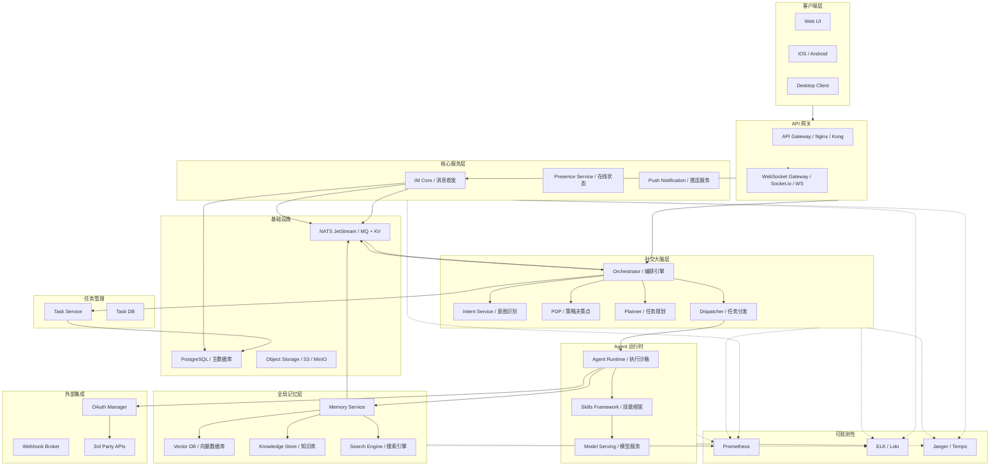
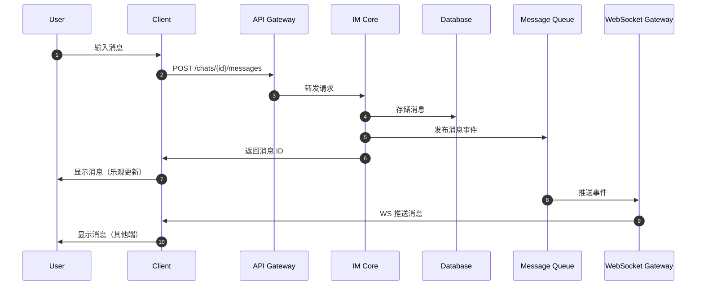
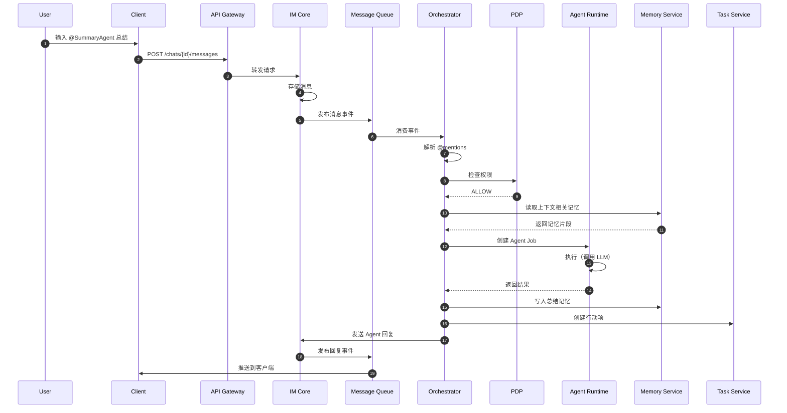
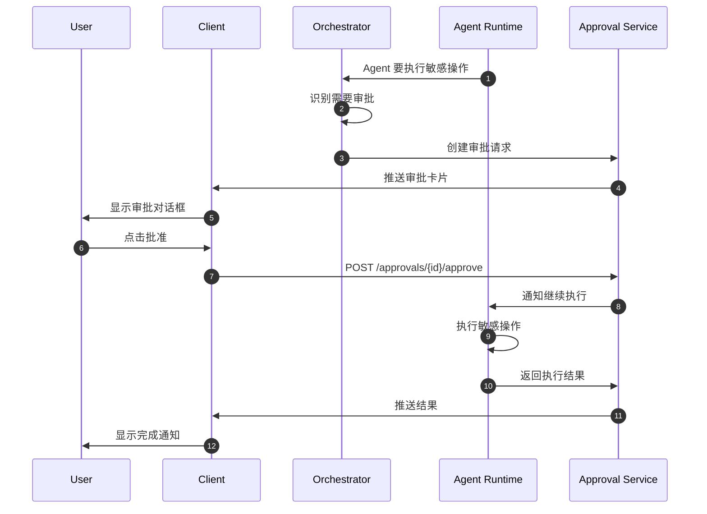
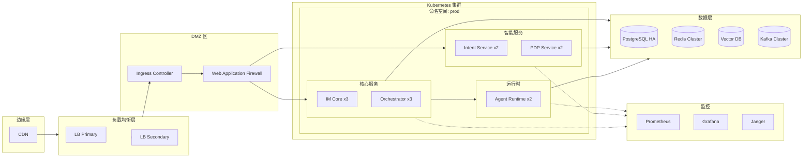

# ClawTeam - 技术架构设计

> **文档版本**: v1.0
> **创建时间**: 2026-02-14
> **架构风格**: 微服务 + 事件驱动

## 📋 目录

- [1. 整体架构](#1-整体架构)
- [2. 服务拆分](#2-服务拆分)
- [3. 数据流](#3-数据流)
- [4. 部署架构](#4-部署架构)
- [5. 技术栈选型](#5-技术栈选型)
- [6. 工程分工](#6-工程分工)

---

## 1. 整体架构

### 1.1 系统全景图



### 1.2 分层说明

| 层级 | 职责 | 组件 |
|------|------|------|
| **客户端层** | 用户交互 | Web/Mobile/Desktop |
| **网关层** | 路由、认证、限流 | API Gateway, WS Gateway |
| **核心服务层** | 消息传递 | IM Core, Presence, Push |
| **社交大脑层** | 智能编排 | Orchestrator, Intent, PDP |
| **Agent 运行时** | Agent 执行 | Agent Runtime, Skills |
| **记忆层** | 知识管理 | Memory Service, Vector DB |
| **集成层** | 外部连接 | OAuth, Webhook |

---

## 2. 服务拆分

### 2.1 服务矩阵

| 服务 ID | 服务名称 | 职责 | 技术栈 | 依赖 |
|---------|----------|------|--------|------|
| **SVC-001** | IM Core | 消息收发、存储、分发 | Go | PostgreSQL, Redis, Kafka |
| **SVC-002** | Presence | 在线状态管理 | Go | Redis |
| **SVC-003** | Orchestrator | 消息编排、Agent 调度 | Go/Python | Redis, Kafka, Vector DB |
| **SVC-004** | Intent Service | 意图识别 | Python | ML Runtime |
| **SVC-005** | PDP | 策略决策 | Go | Policy DB |
| **SVC-006** | Agent Runtime | Agent 执行沙箱 | Python | LLM APIs |
| **SVC-007** | Memory Service | 全局记忆管理 | Go | PostgreSQL, Vector DB |
| **SVC-008** | Task Service | 任务管理 | Go | PostgreSQL |
| **SVC-009** | OAuth Manager | 第三方认证 | Go | Redis, PostgreSQL |
| **SVC-010** | Webhook Broker | Webhook 管理 | Go | PostgreSQL |

### 2.2 服务详细说明

#### SVC-001: IM Core

```go
// 核心接口
type IMCore interface {
    // 发送消息
    SendMessage(ctx context.Context, req *SendMessageRequest) (*Message, error)

    // 获取消息历史
    GetMessages(ctx context.Context, chatID string, opts *GetMessagesOptions) ([]*Message, error)

    // 标记已读
    MarkRead(ctx context.Context, userID, chatID string, messageID string) error
}

// 消息结构
type Message struct {
    ID           string            `json:"id"`
    ChatID       string            `json:"chat_id"`
    SenderType   SenderType        `json:"sender_type"` // user / agent
    SenderID     string            `json:"sender_id"`
    ContentType  ContentType       `json:"content_type"`
    Content      string            `json:"content"`
    Attachments  []Attachment       `json:"attachments,omitempty"`
    ReplyTo      *string           `json:"reply_to,omitempty"`
    CreatedAt    time.Time         `json:"created_at"`
    Metadata     map[string]string `json:"metadata,omitempty"`
}
```

#### SVC-003: Orchestrator

```go
// 编排器接口
type Orchestrator interface {
    // 处理消息事件
    HandleMessageEvent(ctx context.Context, event *MessageEvent) error

    // 处理 Agent 回复
    HandleAgentResponse(ctx context.Context, resp *AgentResponse) error

    // 处理用户审批
    HandleApproval(ctx context.Context, req *ApprovalRequest) error
}

// 消息事件
type MessageEvent struct {
    MessageID    string            `json:"message_id"`
    ChatID       string            `json:"chat_id"`
    SenderID     string            `json:"sender_id"`
    Content      string            `json:"content"`
    Mentions     []string          `json:"mentions"` // @users, @agents
    Timestamp    time.Time         `json:"timestamp"`
    Metadata     map[string]string `json:"metadata,omitempty"`
}

// 编排结果
type OrchestrationResult struct {
    Actions      []Action          `json:"actions"`
    AgentJobs    []*AgentJob       `json:"agent_jobs"`
    MemoryWrites []*MemoryWrite    `json:"memory_writes"`
    TaskCreates  []*TaskCreate     `json:"task_creates"`
}
```

#### SVC-006: Agent Runtime

```python
# Agent 运行时接口
class AgentRuntime(ABC):
    @abstractmethod
    async def execute_job(self, job: AgentJob) -> AgentResult:
        """执行 Agent 任务"""
        pass

    @abstractmethod
    async def get_capabilities(self, agent_id: str) -> List[Capability]:
        """获取 Agent 能力列表"""
        pass

    @abstractmethod
    async def validate_tool_call(self, tool: str, params: dict) -> bool:
        """验证工具调用是否被允许"""
        pass

# Agent 任务
@dataclass
class AgentJob:
    job_id: str
    agent_id: str
    instruction: str
    context: ExecutionContext
    memory_refs: List[str]
    tools_allowed: List[str]
    timeout: int

# Agent 结果
@dataclass
class AgentResult:
    job_id: str
    agent_id: str
    response: str
    citations: List[str]  # 引用的消息/记忆 ID
    action_items: List[ActionItem]
    memory_candidates: List[MemoryEntry]
    tool_calls: List[ToolCall]
```

#### SVC-007: Memory Service

```go
// 记忆服务接口
type MemoryService interface {
    // 搜索记忆
    Search(ctx context.Context, query *SearchQuery) (*SearchResult, error)

    // 写入记忆
    Write(ctx context.Context, entry *MemoryEntry) (string, error)

    // 获取记忆详情
    Get(ctx context.Context, id string) (*MemoryEntry, error)

    // 订阅关键词
    Subscribe(ctx context.Context, userID string, keywords []string) error
}

// 记忆条目
type MemoryEntry struct {
    ID              string            `json:"id"`
    Scope           MemoryScope       `json:"scope"` // global, chat, user
    ChatID          *string           `json:"chat_id,omitempty"`
    Type            MemoryType        `json:"type"` // summary, decision, action, knowledge
    SummaryText     string            `json:"summary_text"`
    Content         string            `json:"content,omitempty"`
    SourceMessageIDs []string         `json:"source_message_ids"`
    Tags            []string          `json:"tags"`
    Embedding       []float32         `json:"embedding,omitempty"`
    CreatedBy       string            `json:"created_by"` // user_id or agent_id
    CreatedAt       time.Time         `json:"created_at"`
    ExpiresAt       *time.Time        `json:"expires_at,omitempty"`
    Status          MemoryStatus      `json:"status"` // active, deprecated
}

// 搜索查询
type SearchQuery struct {
    Query          string            `json:"query"`
    Scope          MemoryScope       `json:"scope"`
    ChatID         *string           `json:"chat_id,omitempty"`
    Types          []MemoryType      `json:"types,omitempty"`
    Tags           []string          `json:"tags,omitempty"`
    Limit          int               `json:"limit"`
}
```

---

## 3. 数据流

### 3.1 消息发送流程（无 AI）



### 3.2 @Agent 触发流程



### 3.3 审批流程（敏感操作）



---

## 4. 部署架构

### 4.1 部署拓扑



### 4.2 环境划分

| 环境 | 用途 | 配置 |
|------|------|------|
| **dev** | 开发环境 | 单实例部署 |
| **staging** | 预发环境 | 生产配置副本 |
| **prod** | 生产环境 | 高可用部署 |

### 4.3 容量规划

| 服务 | CPU | 内存 | 实例数 |
|------|-----|------|--------|
| IM Core | 2c | 4Gi | 3+ |
| Orchestrator | 4c | 8Gi | 3+ |
| Agent Runtime | 4c | 16Gi | 2+ |
| Memory Service | 2c | 8Gi | 2+ |
| Intent Service | 4c | 8Gi | 2+ |

---

## 5. 技术栈选型

### 5.1 后端技术栈

| 类别 | 技术选择 | 理由 |
|------|----------|------|
| **编程语言** | Go (服务) / Python (AI) | Go 高并发，Python AI 生态 |
| **API 框架** | gRPC + REST | gRPC 内部，REST 外部 |
| **消息队列** | NATS JetStream | 轻量、支持 MQ + KV、简化架构 |
| **数据库** | PostgreSQL | 关系型、JSON 支持 |
| **向量数据库** | Qdrant / pgvector | 高性能向量检索 |
| **搜索引擎** | Elasticsearch | 复杂搜索需求 |
| **存储** | MinIO / S3 | 对象存储 |

### 5.2 AI 技术栈

| 类别 | 技术选择 | 理由 |
|------|----------|------|
| **LLM 接入** | Anthropic / OpenAI API | 商业 API |
| **本地模型** | LLaMA / Mistral | 隐私场景 |
| **推理框架** | vLLM / Ollama | 高性能推理 |
| **Embedding** | OpenAI / Sentence Transformers | 向量化 |
| **联邦学习** | Flower / PySyft | 隐私保护 |

### 5.3 前端技术栈

| 类别 | 技术选择 | 理由 |
|------|----------|------|
| **Web** | React + TypeScript | 生态成熟 |
| **移动端** | React Native / Flutter | 跨平台 |
| **桌面端** | Electron / Tauri | 跨平台 |
| **实时通信** | Socket.io / WebSocket | 实时消息 |

### 5.4 基础设施

| 类别 | 技术选择 | 理由 |
|------|----------|------|
| **容器编排** | Kubernetes | 云原生标准 |
| **服务网格** | Istio (可选) | 流量管理 |
| **API 网关** | Kong / Nginx | 路由、认证 |
| **监控** | Prometheus + Grafana | 指标监控 |
| **日志** | Loki / ELK | 日志聚合 |
| **链路追踪** | Jaeger / Tempo | 分布式追踪 |
| **CI/CD** | GitHub Actions / ArgoCD | 自动化部署 |

---

## 6. 工程分工

### 6.1 团队结构

```
┌─────────────────────────────────────────────────────────────┐
│                        工程团队组织                           │
├─────────────────────────────────────────────────────────────┤
│                                                               │
│    ┌──────────────┐  ┌──────────────┐  ┌──────────────┐       │
│    │ IM 团队      │  │ AI 团队      │  │ Platform 团队 │       │
│    │ (2-3人)     │  │ (2-3人)     │  │ (2-3人)     │       │
│    │              │  │              │  │              │       │
│    │ - 消息收发   │  │ - Agent Runtime│ - Memory     │       │
│    │ - WebSocket  │  │ - Skills    │  │ - Task      │       │
│    │ - Presence   │  │ - LLM 集成  │  │ - Search    │       │
│    │              │  │ - Intent    │  │ - Integration│       │
│    └──────────────┘  └──────────────┘  └──────────────┘       │
│                                                               │
│                    ┌──────────────┐                           │
│                    │ SRE 团队     │                           │
│                    │ (1-2人)     │                           │
│                    │              │                           │
│                    │ - 部署      │                           │
│                    │ - 监控      │                           │
│                    │ - 安全      │                           │
│                    └──────────────┘                           │
│                                                               │
└─────────────────────────────────────────────────────────────┘
```

### 6.2 开发排期建议

| 阶段 | 周期 | 交付物 |
|------|------|--------|
| **Phase 0** | 1 周 | 技术选型确认、环境搭建 |
| **Phase 1** | 3 周 | IM Core、基础 Agent Runtime |
| **Phase 2** | 3 周 | Memory Service、简单 Agent |
| **Phase 3** | 2 周 | Orchestrator、PDP |
| **Phase 4** | 2 周 | Task Service、外部集成 |
| **Phase 5** | 1 周 | 监控、测试、优化 |

---

## 🏷️ 标签

`#技术架构` `#微服务` `#事件驱动` `#技术选型` `#部署架构`
