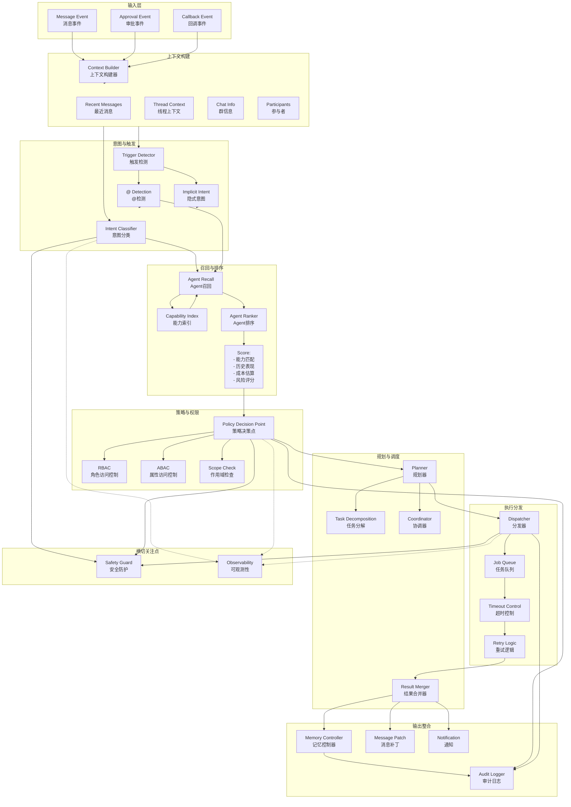
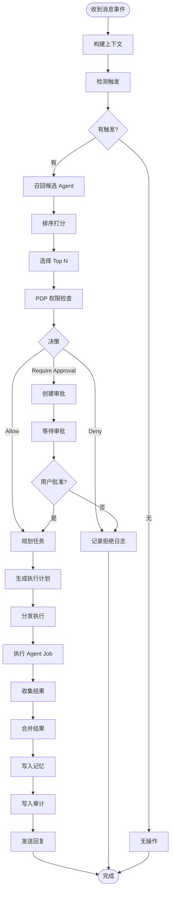

# ClawTeam - Social Brain 架构详解

> **文档版本**: v1.0
> **创建时间**: 2026-02-14
> **核心定位**: 事件驱动的智能编排中枢

## 📋 目录

- [1. 架构概述](#1-架构概述)
- [2. 模块详解](#2-模块详解)
- [3. 核心接口](#3-核心接口)
- [4. 决策流程](#4-决策流程)
- [5. 异常处理](#5-异常处理)

---

## 1. 架构概述

### 1.1 Social Brain 定位

Social Brain 是 ClawTeam 的 **"智能调度中枢"**，负责：

1. **理解**当前聊天的上下文和意图
2. **决策**是否触发 Agent，触发哪些 Agent
3. **编排**多 Agent 协作任务
4. **控制**权限边界和安全策略
5. **整合**多个 Agent 的结果
6. **记忆**决策过程和结果

### 1.2 模块架构图



---

## 2. 模块详解

### 2.1 Context Builder（上下文构建器）

**职责**: 为事件处理构建完整的执行上下文

```go
type ContextBuilder interface {
    Build(ctx context.Context, event *MessageEvent) (*ExecutionContext, error)
}

type ExecutionContext struct {
    // 事件基础信息
    EventID    string            `json:"event_id"`
    EventType  EventType         `json:"event_type"`
    Timestamp  time.Time         `json:"timestamp"`

    // 消息上下文
    RecentMessages   []*Message   `json:"recent_messages"`   // 最近 N 条消息
    ThreadMessages   []*Message   `json:"thread_messages"`   // 线程中的消息
    ReplyChain       []*Message   `json:"reply_chain"`       // 回复链

    // 聊天上下文
    ChatID       string           `json:"chat_id"`
    ChatType     ChatType         `json:"chat_type"`         // private/group/public
    ChatMetadata map[string]string `json:"chat_metadata"`

    // 参与者信息
    Participants []*Participant   `json:"participants"`

    // 全局记忆上下文
    MemoryContext []*MemoryHit    `json:"memory_context"`

    // 预计算的属性
    MessageCount     int           `json:"message_count"`
    HasImages        bool          `json:"has_images"`
    HasVideos        bool          `json:"has_videos"`
    MentionedAgents  []string      `json:"mentioned_agents"`
    MentionedUsers   []string      `json:"mentioned_users"`
}
```

**构建策略**:

| 上下文类型 | 获取方式 | 数量限制 |
|----------|----------|----------|
| 最近消息 | 从数据库/缓存读取 | 100 条 |
| 线程消息 | 按回复链展开 | 50 条 |
| 群信息 | 从缓存读取 | 1 个 |
| 参与者 | 从成员表读取 | 全部 |
| 记忆上下文 | 向量检索 | Top 10 |

### 2.2 Intent & Trigger Engine（意图与触发引擎）

**职责**: 识别用户意图，决定是否触发 Agent

```go
type IntentService interface {
    // 分类意图
    Classify(ctx context.Context, event *MessageEvent, execCtx *ExecutionContext) (*Intent, error)

    // 检测触发
    DetectTriggers(ctx context.Context, event *MessageEvent, execCtx *ExecutionContext) ([]Trigger, error)
}

type Intent struct {
    // 意图分类
    Category    IntentCategory `json:"category"`    // qa, summarize, action, search, create, chitchat
    Subcategory string         `json:"subcategory"` // finer-grained category

    // 置信度
    Confidence  float64        `json:"confidence"`  // 0-1

    // 实体提取
    Entities    []Entity       `json:"entities"`

    // 是否需要 Agent
    NeedsAgent  bool           `json:"needs_agent"`
}

type Trigger struct {
    // 触发类型
    Type        TriggerType    `json:"type"`        // explicit_mention, implicit_intent, keyword

    // 触发源
    Source      string         `json:"source"`      // agent_id or intent category

    // 触发位置
    Position    MessagePosition `json:"position"`   // start, middle, end

    // 上下文
    Context     string         `json:"context"`
}

type IntentCategory string

const (
    IntentQA           IntentCategory = "qa"            // 问答
    IntentSummarize    IntentCategory = "summarize"     // 总结
    IntentAction       IntentCategory = "action"        // 执行动作
    IntentSearch       IntentCategory = "search"        // 搜索
    IntentCreate       IntentCategory = "create"        // 创建内容
    IntentChitchat     IntentCategory = "chitchat"      // 闲聊
    IntentUnknown      IntentCategory = "unknown"       // 未知
)
```

**触发判定逻辑**:

```
┌─────────────────────────────────────────────────────────────┐
│                        触发判定流程                           │
├─────────────────────────────────────────────────────────────┤
│                                                               │
│  1. 显式 @ 检测                                                │
│     ├── 解析消息中的 @mentions                                 │
│     ├── 过滤出 @Agent（排除 @User）                            │
│     └── 生成 explicit_mention 触发                            │
│                                                               │
│  2. 隐式意图检测                                                │
│     ├── 意图分类（置信度 > 阈值）                               │
│     ├── 检查是否为"需要 Agent"的意图类型                        │
│     └── 生成 implicit_intent 触发                             │
│                                                               │
│  3. 关键词触发（可选，MVP 后）                                   │
│     ├── 匹配预定义关键词                                       │
│     └── 生成 keyword 触发                                      │
│                                                               │
│  4. 触发合并与去重                                             │
│     └── 合并所有触发，去重 Agent                               │
│                                                               │
└─────────────────────────────────────────────────────────────┘
```

### 2.3 Agent Recall & Ranker（召回与排序）

**职责**: 从候选 Agent 中筛选并排序

```go
type RecallEngine interface {
    // 召回候选 Agent
    Recall(ctx context.Context, intent *Intent, execCtx *ExecutionContext) ([]string, error)
}

type Ranker interface {
    // 对候选 Agent 排序
    Rank(ctx context.Context, candidates []string, intent *Intent, execCtx *ExecutionContext) ([]*ScoredAgent, error)
}

type ScoredAgent struct {
    AgentID     string   `json:"agent_id"`
    Score       float64  `json:"score"`
    Reasons     []string `json:"reasons"`     // 打分原因
    Capabilities []string `json:"capabilities"`
}

// 打分公式
type ScoringConfig struct {
    WeightCapabilityMatch   float64  `json:"weight_capability_match"`   // 0.4
    WeightChatRelevance     float64  `json:"weight_chat_relevance"`     // 0.2
    WeightHistoricalSuccess float64  `json:"weight_historical_success"` // 0.2
    WeightEstimatedCost     float64  `json:"weight_estimated_cost"`     // -0.1
    WeightRiskLevel         float64  `json:"weight_risk_level"`         // -0.1
}
```

**召回策略**:

| 策略 | 描述 | 示例 |
|------|------|------|
| **能力匹配** | 根据意图类型匹配 Agent 能力 | summarize → @SummaryAgent |
| **显式指定** | 直接使用 @ 的 Agent | @ResearchAgent |
| **群配置** | 群内启用的 Agent | 群配置的默认 Agent |
| **历史偏好** | 用户/群常用的 Agent | 过去 7 天使用最多的 |

**排序因子**:

```
最终得分 = Σ(权重 × 因子)

因子 = {
  能力匹配度:    [0, 1]
  聊天相关度:    [0, 1]
  历史成功率:    [0, 1]
  估算成本:      [0, 1] (惩罚项)
  风险评分:      [0, 1] (惩罚项)
}
```

### 2.4 Policy Decision Point (PDP)（策略决策点）

**职责**: 权限控制与安全策略

```go
type PDPService interface {
    // 评估请求是否允许
    Evaluate(ctx context.Context, req *PolicyRequest) (*PolicyDecision, error)

    // 检查是否需要用户审批
    RequiresApproval(ctx context.Context, req *PolicyRequest) (bool, *ApprovalTemplate, error)
}

type PolicyRequest struct {
    // 主体
    Subject     Subject         `json:"subject"`     // who

    // 动作
    Action      Action          `json:"action"`      // what

    // 资源
    Resource    Resource        `json:"resource"`    // target

    // 环境
    Environment Environment     `json:"environment"` // context
}

type Subject struct {
    ID         string          `json:"id"`
    Type       SubjectType     `json:"type"`         // user, agent
    Attributes map[string]string `json:"attributes"`
}

type Action struct {
    Category    ActionCategory  `json:"category"`     // read, write, execute
    Operation   string          `json:"operation"`    // read_memory, write_memory, send_email, ...
    Tool        *string         `json:"tool,omitempty"` // 具体工具
}

type Resource struct {
    Type       ResourceType    `json:"type"`         // message, memory, task, external_system
    ID         string          `json:"id"`
    Scope      string          `json:"scope"`        // global, chat, user
}

type PolicyDecision struct {
    Effect      Effect          `json:"effect"`       // allow, deny
    Reason      string          `json:"reason"`
    Constraints []Constraint    `json:"constraints"`
}

type Effect string

const (
    EffectAllow         Effect = "allow"
    EffectDeny          Effect = "deny"
    EffectRequireApproval Effect = "require_approval"
)
```

**策略规则示例**:

```yaml
# Agent 默认策略
agent_policies:
  # 读消息
  - id: AP-001
    subject:
      type: agent
    action:
      category: read
      operation: read_messages
    resource:
      type: message
      scope: chat
    effect: allow
    condition: agent_in_chat

  # 写记忆
  - id: AP-002
    subject:
      type: agent
    action:
      category: write
      operation: write_memory
    resource:
      type: memory
    effect: require_approval
    condition: chat_admin_enabled

  # 外部操作
  - id: AP-003
    subject:
      type: agent
    action:
      category: execute
      operation: external_action
    resource:
      type: external_system
    effect: require_approval
    always: true
```

### 2.5 Planner（规划器）

**职责**: 任务分解与执行计划

```go
type Planner interface {
    // 生成执行计划
    Plan(ctx context.Context, intent *Intent, agents []*ScoredAgent, execCtx *ExecutionContext) (*ExecutionPlan, error)
}

type ExecutionPlan struct {
    PlanID      string          `json:"plan_id"`

    // 任务列表
    Tasks       []*AgentTask    `json:"tasks"`

    // 执行策略
    Strategy    ExecutionStrategy `json:"strategy"`    // sequential, parallel, pipeline

    // 超时控制
    Timeout     time.Duration   `json:"timeout"`

    // 合并策略
    MergeStrategy MergeStrategy  `json:"merge_strategy"` // best_of, consensus, primary_reviewer
}

type AgentTask struct {
    TaskID      string          `json:"task_id"`
    AgentID     string          `json:"agent_id"`
    Instruction string          `json:"instruction"`
    Context     TaskContext     `json:"context"`
    DependsOn   []string        `json:"depends_on"`   // 依赖的任务 ID
    Timeout     time.Duration   `json:"timeout"`
    Retry       int             `json:"retry"`
}

type ExecutionStrategy string

const (
    StrategySequential ExecutionStrategy = "sequential"  // 顺序执行
    StrategyParallel   ExecutionStrategy = "parallel"    // 并行执行
    StrategyPipeline   ExecutionStrategy = "pipeline"    // 流水线
)

type MergeStrategy string

const (
    MergeBestOf       MergeStrategy = "best_of"         // 选最好的
    MergeConsensus     MergeStrategy = "consensus"       // 共识
    MergePrimaryReview MergeStrategy = "primary_review" // 主审模式
    MergeAll           MergeStrategy = "all"             // 全部返回
)
```

**任务分解示例**:

```
原始请求: "@ResearchAgent 帮我找一下竞品差异，并总结成表格"

任务分解:
┌─────────────────────────────────────────────────────────────┐
│  Task 1: 竞品信息搜集                                         │
│  ├── Agent: @ResearchAgent                                   │
│  ├── Instruction: "搜索以下竞品的差异: Slack, Teams, WeChat" │
│  └── Output: 竞品信息列表                                     │
├─────────────────────────────────────────────────────────────┤
│  Task 2: 表格生成                                             │
│  ├── Agent: @SummaryAgent                                     │
│  ├── Instruction: "将竞品信息整理成对比表格"                   │
│  ├── DependsOn: Task 1                                        │
│  └── Output: Markdown 表格                                    │
└─────────────────────────────────────────────────────────────┘
```

### 2.6 Dispatcher（分发器）

**职责**: 任务分发与执行控制

```go
type Dispatcher interface {
    // 执行计划
    Dispatch(ctx context.Context, plan *ExecutionPlan) (*DispatchResult, error)

    // 取消执行
    Cancel(ctx context.Context, planID string) error
}

type DispatchResult struct {
    PlanID       string            `json:"plan_id"`
    Status       DispatchStatus    `json:"status"`
    Results      []*TaskResult     `json:"results"`
    Errors       []error           `json:"errors"`
    StartTime    time.Time         `json:"start_time"`
    EndTime      time.Time         `json:"end_time"`
}

type TaskResult struct {
    TaskID      string            `json:"task_id"`
    AgentID     string            `json:"agent_id"`
    Status      TaskStatus        `json:"status"`
    Response    string            `json:"response"`
    Citations   []string          `json:"citations"`
    ActionItems []*ActionItem     `json:"action_items"`
    Error       error             `json:"error,omitempty"`
}

type DispatchStatus string

const (
    DispatchPending   DispatchStatus = "pending"
    DispatchRunning   DispatchStatus = "running"
    DispatchCompleted DispatchStatus = "completed"
    DispatchFailed    DispatchStatus = "failed"
    DispatchCancelled DispatchStatus = "cancelled"
)
```

### 2.7 Result Merger（结果合并器）

**职责**: 合并多个 Agent 的结果

```go
type Merger interface {
    // 合并结果
    Merge(ctx context.Context, results []*TaskResult, strategy MergeStrategy) (*MergedResult, error)
}

type MergedResult struct {
    Response     string            `json:"response"`
    Citations    []string          `json:"citations"`
    ActionItems  []*ActionItem     `json:"action_items"`
    Provenance   map[string]string `json:"provenance"` // 引用溯源
    Confidence   float64           `json:"confidence"`
}
```

**合并策略详解**:

| 策略 | 适用场景 | 算法 |
|------|----------|------|
| **best_of** | 总结类 | 选择最全面且最少的幻觉结果 |
| **consensus** | 行动类 | 多数一致才执行，否则确认 |
| **primary_reviewer** | 代码类 | 主 Agent 生成，审核 Agent 检查 |
| **all** | 创意类 | 全部展示，让用户选择 |

### 2.8 Memory Controller（记忆控制器）

**职责**: 控制全局记忆的读写

```go
type MemoryController interface {
    // 读取相关记忆
    Fetch(ctx context.Context, query string, scope MemoryScope) ([]*MemoryHit, error)

    // 写入记忆
    Write(ctx context.Context, entry *MemoryEntry) (string, error)

    // 批量写入
    WriteBatch(ctx context.Context, entries []*MemoryEntry) ([]string, error)
}

type MemoryHit struct {
    Entry      *MemoryEntry    `json:"entry"`
    Score      float64         `json:"score"`      // 相关性得分
    Provenance string          `json:"provenance"` // 来源说明
}
```

### 2.9 Audit Logger（审计日志）

**职责**: 记录所有决策和操作

```go
type AuditLogger interface {
    // 记录决策
    LogDecision(ctx context.Context, decision *DecisionLog) error

    // 记录操作
    LogAction(ctx context.Context, action *ActionLog) error
}

type DecisionLog struct {
    DecisionID  string            `json:"decision_id"`
    EventID     string            `json:"event_id"`
    Timestamp   time.Time         `json:"timestamp"`

    // 决策内容
    Intent      *Intent           `json:"intent"`
    Agents      []string          `json:"agents_selected"`
    Policy      *PolicyDecision   `json:"policy_decision"`

    // 溯源
    Provenance  map[string]string `json:"provenance"`
}

type ActionLog struct {
    ActionID    string            `json:"action_id"`
    Actor       string            `json:"actor"`       // user_id or agent_id
    ActorType   SubjectType       `json:"actor_type"`
    Action      string            `json:"action"`
    Target      string            `json:"target"`
    Timestamp   time.Time         `json:"timestamp"`
    PayloadHash string            `json:"payload_hash"`
}
```

---

## 3. 核心接口

### 3.1 主处理接口

```go
type SocialBrain interface {
    // 处理消息事件
    HandleMessageEvent(ctx context.Context, event *MessageEvent) (*OrchestrationResult, error)

    // 处理审批回调
    HandleApproval(ctx context.Context, approval *ApprovalRequest) error

    // 处理 Agent 回调
    HandleAgentCallback(ctx context.Context, callback *AgentCallback) error
}

type OrchestrationResult struct {
    // 结果类型
    Type        ResultType       `json:"type"`

    // Agent 结果
    AgentResults []*AgentResult  `json:"agent_results,omitempty"`

    // 记忆写入
    MemoryWrites []*MemoryEntry  `json:"memory_writes,omitempty"`

    // 任务创建
    TaskCreates []*Task          `json:"task_creates,omitempty"`

    // 需要审批
    ApprovalRequired *ApprovalTemplate `json:"approval_required,omitempty"`
}

type ResultType string

const (
    ResultAgentReply       ResultType = "agent_reply"
    ResultMemoryWrite      ResultType = "memory_write"
    ResultTaskCreate       ResultType = "task_create"
    ResultApprovalRequired ResultType = "approval_required"
    ResultNoAction         ResultType = "no_action"
)
```

### 3.2 内部通信接口

```protobuf
// gRPC 服务定义
service SocialBrain {
    // 处理事件
    rpc HandleEvent(EventRequest) returns (EventResponse);

    // 查询状态
    rpc GetStatus(StatusRequest) returns (StatusResponse);

    // 取消操作
    rpc Cancel(CancelRequest) returns (CancelResponse);
}

message EventRequest {
    string event_id = 1;
    google.protobuf.Any event = 2;  // MessageEvent, ApprovalEvent, CallbackEvent
    map<string, string> metadata = 3;
}

message EventResponse {
    bool accepted = 1;
    string result_id = 2;
    repeated string action_ids = 3;  // 可用于跟踪/取消
}
```

---

## 4. 决策流程

### 4.1 完整决策流程图



### 4.2 决策表

| 条件 | 动作 |
|------|------|
| 无 @ 且意图置信度 < 阈值 | 无操作 |
| 有 @ 但 Agent 不在群 | 提示用户 |
| 有 @ 但权限不足 | 请求审批或拒绝 |
| 有 @ 且权限允许 | 执行 Agent Job |
| 隐式触发且高风险 | 请求确认 |
| 隐式触发且低风险 | 自动执行 |

---

## 5. 异常处理

### 5.1 异常类型与处理策略

| 异常类型 | 处理策略 |
|----------|----------|
| **超时** | 取消任务，返回部分结果（如有），记录日志 |
| **Agent 失败** | 重试（有限次数），降级到其他 Agent |
| **PDP 拒绝** | 记录原因，通知用户 |
| **用户拒绝审批** | 取消任务，记录日志 |
| **系统过载** | 返回降级服务，加入队列稍后处理 |

### 5.2 重试策略

```go
type RetryPolicy struct {
    MaxAttempts  int           `json:"max_attempts"`  // 最大尝试次数
    InitialDelay time.Duration `json:"initial_delay"` // 初始延迟
    MaxDelay     time.Duration `json:"max_delay"`     // 最大延迟
    Multiplier   float64       `json:"multiplier"`    // 延迟倍数
    BackoffType  BackoffType   `json:"backoff_type"`  // fixed, exponential
}

type BackoffType string

const (
    BackoffFixed       BackoffType = "fixed"
    BackoffExponential BackoffType = "exponential"
)

// 默认策略
var DefaultRetryPolicy = &RetryPolicy{
    MaxAttempts:  3,
    InitialDelay: 1 * time.Second,
    MaxDelay:     30 * time.Second,
    Multiplier:   2.0,
    BackoffType:  BackoffExponential,
}
```

---

## 🏷️ 标签

`#Social Brain` `#编排架构` `#意图识别` `#权限控制` `#决策流程`
