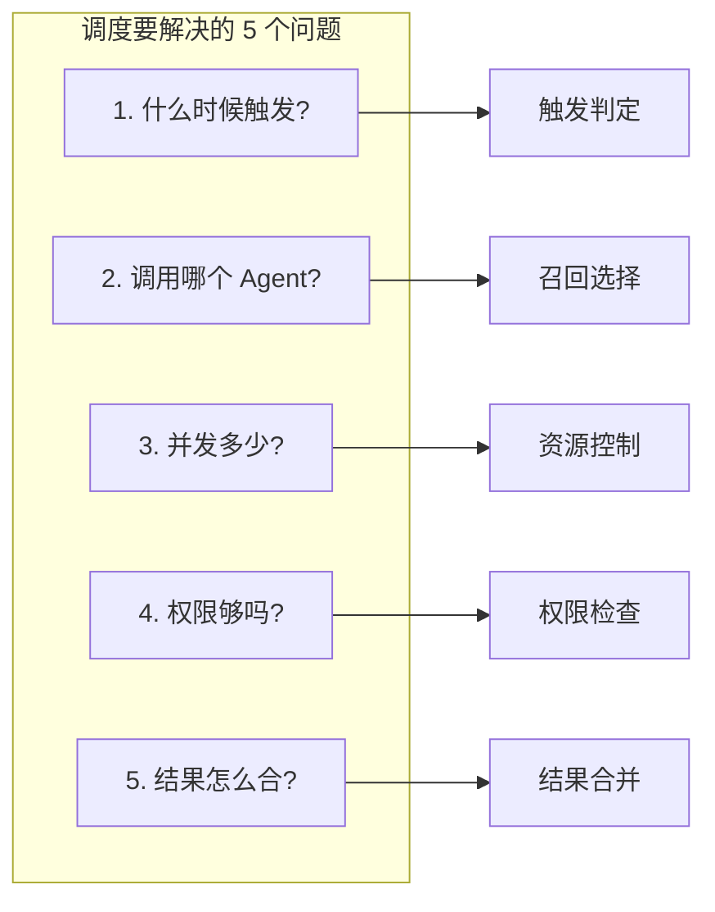
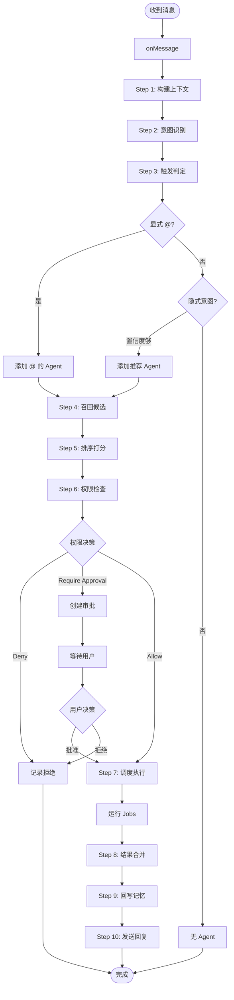
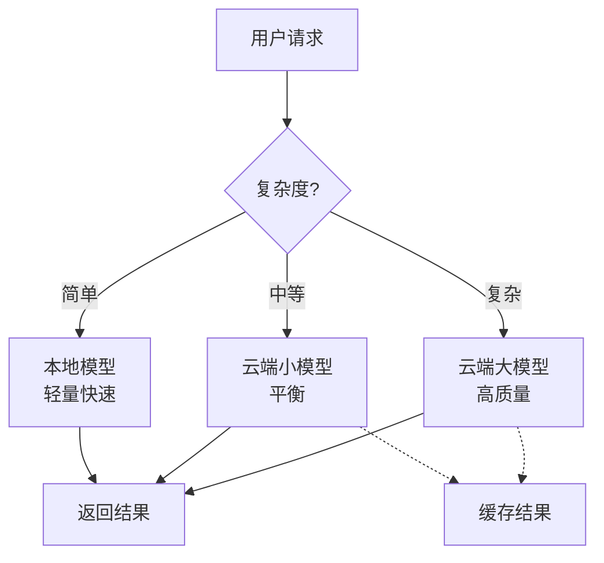

# ClawTeam - Agent 调度算法

> **文档版本**: v1.0
> **创建时间**: 2026-02-14
> **核心目标**: 在正确的时间调用正确的 Agent

## 📋 目录

- [1. 调度问题定义](#1-调度问题定义)
- [2. 调度流程](#2-调度流程)
- [3. 召回算法](#3-召回算法)
- [4. 排序算法](#4-排序算法)
- [5. 合并策略](#5-合并策略)
- [6. 成本控制](#6-成本控制)

---

## 1. 调度问题定义

### 1.1 核心问题

Agent 调度需要解决 5 个核心问题：



### 1.2 调度目标

| 目标 | 优先级 | 说明 |
|------|--------|------|
| **准确性** | P0 | 选择最合适的 Agent |
| **响应速度** | P0 | 尽快返回结果 |
| **成本控制** | P1 | 最小化 token 消耗 |
| **用户体验** | P1 | 减少等待和打扰 |
| **系统稳定性** | P2 | 防止过载 |

---

## 2. 调度流程

### 2.1 完整流程



### 2.2 伪代码实现

```python
async def orchestrate(event: MessageEvent) -> OrchestrationResult:
    """
    主编排函数
    """
    # ===== Step 1: 构建上下文 =====
    ctx = await build_context(
        chat_id=event.chat_id,
        recent_messages=100,  # 最近 100 条消息
        include_thread=True,
        include_participants=True
    )

    # ===== Step 2: 意图识别 =====
    intent = await intent_classifier.classify(event, ctx)

    # ===== Step 3: 触发判定 =====
    triggers = []

    # 显式触发
    if event.has_explicit_mentions:
        triggers.extend([
            Trigger(type='explicit_mention', source=agent_id)
            for agent_id in event.mentioned_agents
        ])

    # 隐式触发
    if intent.confidence > 0.7 and intent.needs_agent:
        triggers.extend([
            Trigger(type='implicit_intent', source=agent_id)
            for agent_id in await recommend_agents(intent, ctx)
        ])

    if not triggers:
        return OrchestrationResult(type='no_action')

    # ===== Step 4: 召回候选 Agent =====
    candidates = await agent_recall.recall(
        triggers=triggers,
        intent=intent,
        context=ctx
    )

    # ===== Step 5: 排序打分 =====
    scored = await agent_ranker.rank(
        candidates=candidates,
        intent=intent,
        context=ctx
    )

    # ===== Step 6: 权限检查 =====
    executable = []
    approval_required = []

    for item in scored:
        decision = await pdp.evaluate(
            agent_id=item.agent_id,
            user_id=event.sender_id,
            intent=intent,
            context=ctx
        )

        if decision.effect == 'allow':
            executable.append(item)
        elif decision.effect == 'require_approval':
            approval_required.append(item)

    # 处理需要审批的
    if approval_required:
        approval_result = await request_user_approval(
            approval_required,
            intent=intent
        )
        if approval_result.approved:
            executable.extend(approval_result.approved_items)

    if not executable:
        return OrchestrationResult(type='denied')

    # ===== Step 7: 调度执行 =====
    plans = [
        make_agent_job(
            agent=item.agent_id,
            intent=intent,
            context=ctx,
            memory_read_scopes=item.memory_scopes
        )
        for item in executable
    ]

    results = await run_jobs(
        plans,
        concurrency=len(executable),  # 并发执行
        timeout=30  # 30 秒超时
    )

    # ===== Step 8: 结果合并 =====
    merged = await merge_results(
        results=results,
        strategy=select_merge_strategy(intent)
    )

    # ===== Step 9: 回写记忆 =====
    await memory_write(
        summaries=merged.summaries,
        action_items=merged.action_items,
        decisions=merged.decisions,
        provenance=results
    )

    # ===== Step 10: 审计 =====
    await audit_log(
        event=event,
        intent=intent,
        plans=plans,
        results=results
    )

    # ===== Step 11: 发送回复 =====
    return await post_to_chat(
        response=merged.response,
        citations=merged.citations
    )
```

---

## 3. 召回算法

### 3.1 召回策略

```mermaid
flowchart TD
    subgraph Recall["召回策略"]
        A[能力匹配召回]
        B[显式召回]
        C[群配置召回]
        D[历史偏好召回]
        E[相似场景召回]
    end

    Intent[意图: summarize] --> A
    Mention[@SummaryAgent] --> B
    ChatConfig[群默认 Agent] --> C
    History[过去7天最常用] --> D
    Similar[相似场景成功过] --> E

    A --> Union[Union 去重]
    B --> Union
    C --> Union
    D --> Union
    E --> Union

    Union --> Candidates[候选 Agent 列表]
```

### 3.2 能力索引

```python
class CapabilityIndex:
    """
    Agent 能力索引，支持快速查找
    """

    def __init__(self):
        # 能力 -> Agent IDs 反向索引
        self.capability_index: Dict[str, Set[str]] = defaultdict(set)

        # Agent -> 能力声明
        self.agent_capabilities: Dict[str, List[Capability]] = {}

    def register(self, agent_id: str, capabilities: List[Capability]):
        """注册 Agent 能力"""
        self.agent_capabilities[agent_id] = capabilities

        for cap in capabilities:
            # 按能力类型索引
            self.capability_index[cap.type].add(agent_id)

            # 按具体能力索引
            if cap.name:
                self.capability_index[f"{cap.type}:{cap.name}"].add(agent_id)

    def lookup(self, intent: Intent) -> Set[str]:
        """根据意图查找候选 Agent"""
        candidates = set()

        # 意图类型映射到能力类型
        intent_to_capability = {
            'qa': 'qa',
            'summarize': 'summarize',
            'search': 'search',
            'create': 'create',
            'action': 'action',
        }

        cap_type = intent_to_capability.get(intent.category)
        if cap_type:
            candidates.update(self.capability_index.get(cap_type, set()))

        # 考虑子类别
        if intent.subcategory:
            candidates.update(
                self.capability_index.get(f"{cap_type}:{intent.subcategory}", set())
            )

        return candidates
```

### 3.3 召回配置

| 召回策略 | 配置参数 | 默认值 |
|----------|----------|--------|
| **能力匹配** | 启用/禁用 | ✅ 启用 |
| **显式召回** | 启用/禁用 | ✅ 启用 |
| **群配置** | 启用/禁用 | ✅ 启用 |
| **历史偏好** | 时间窗口 | 7 天 |
| **相似场景** | 相似度阈值 | 0.8 |
| **最大召回数** | N | 10 |

---

## 4. 排序算法

### 4.1 打分公式

```python
def score_agent(
    agent: Agent,
    intent: Intent,
    context: ExecutionContext
) -> ScoredAgent:
    """
    对 Agent 进行打分排序

    Score = Σ(weight_i × factor_i)
    """

    # 能力匹配度 (0-1)
    capability_score = calculate_capability_match(agent, intent)

    # 聊天相关度 (0-1)
    relevance_score = calculate_chat_relevance(agent, context)

    # 历史成功率 (0-1)
    success_score = calculate_historical_success(agent, intent)

    # 估算成本 (0-1, 惩罚项)
    cost_score = calculate_cost_penalty(agent, intent)

    # 风险评分 (0-1, 惩罚项)
    risk_score = calculate_risk_level(agent, intent)

    # 加权求和
    final_score = (
        0.40 * capability_score +
        0.20 * relevance_score +
        0.20 * success_score -
        0.10 * cost_score -
        0.10 * risk_score
    )

    return ScoredAgent(
        agent_id=agent.id,
        score=final_score,
        reasons=[
            f"能力匹配: {capability_score:.2f}",
            f"聊天相关: {relevance_score:.2f}",
            f"历史成功: {success_score:.2f}",
            f"成本惩罚: {cost_score:.2f}",
            f"风险评分: {risk_score:.2f}",
        ]
    )
```

### 4.2 各因子详解

#### 4.2.1 能力匹配度

```python
def calculate_capability_match(agent: Agent, intent: Intent) -> float:
    """
    计算能力匹配度
    """
    # 获取 Agent 的能力
    agent_caps = {cap.type for cap in agent.capabilities}

    # 意图需要的能力
    required_caps = get_required_capabilities(intent)

    if not required_caps:
        return 0.5  # 中性

    # Jaccard 相似度
    intersection = len(agent_caps & required_caps)
    union = len(agent_caps | required_caps)

    return intersection / union if union > 0 else 0
```

#### 4.2.2 聊天相关度

```python
def calculate_chat_relevance(agent: Agent, context: ExecutionContext) -> float:
    """
    计算 Agent 与当前聊天的相关度
    """
    score = 0.0

    # 1. Agent 是否在群配置中
    if agent.id in context.chat_config.enabled_agents:
        score += 0.3

    # 2. Agent 过去在群的活跃度
    agent_activity = get_agent_activity_in_chat(
        agent.id,
        context.chat_id,
        window=timedelta(days=7)
    )
    score += min(agent_activity / 10, 0.3)  # 最多 0.3

    # 3. Agent 是否与话题相关
    topic_match = calculate_topic_match(agent, context)
    score += topic_match * 0.4

    return score
```

#### 4.2.3 历史成功率

```python
def calculate_historical_success(agent: Agent, intent: Intent) -> float:
    """
    计算历史成功率
    """
    # 获取历史执行记录
    history = get_agent_execution_history(
        agent_id=agent.id,
        intent_category=intent.category,
        limit=100
    )

    if not history:
        return 0.5  # 无历史数据，中性

    # 计算成功率
    successful = sum(1 for h in history if h.success)
    success_rate = successful / len(history)

    # 考虑用户满意度
    avg_satisfaction = sum(h.satisfaction for h in history) / len(history)

    return (success_rate * 0.7 + avg_satisfaction * 0.3)
```

#### 4.2.4 成本惩罚

```python
def calculate_cost_penalty(agent: Agent, intent: Intent) -> float:
    """
    计算成本惩罚（越高越好，但在公式中是减项）
    """
    # 估算 token 消耗
    estimated_tokens = estimate_token_usage(agent, intent)

    # 根据预算设定惩罚
    if estimated_tokens < 1000:
        return 0.0  # 低成本，无惩罚
    elif estimated_tokens < 5000:
        return 0.3  # 中等成本
    else:
        return 0.7  # 高成本，高惩罚
```

#### 4.2.5 风险评分

```python
def calculate_risk_level(agent: Agent, intent: Intent) -> float:
    """
    计算风险评分（越高风险越大，但在公式中是减项）
    """
    risk = 0.0

    # 1. 是否需要外部操作
    if intent.category == 'action':
        risk += 0.3

    # 2. Agent 权限范围
    if agent.has_external_write_access:
        risk += 0.3

    # 3. 用户信任度
    trust = get_user_trust_score(agent.id)
    risk += (1.0 - trust) * 0.4

    return risk
```

---

## 5. 合并策略

### 5.1 策略选择矩阵

| 策略 | 适用场景 | 算法描述 | 输出示例 |
|------|----------|----------|----------|
| **best_of** | 总结类、QA 类 | 选最全面且最少幻觉的结果 | 单个最佳回答 |
| **consensus** | 行动类 | 多数一致才执行，否则确认 | 共识行动或确认请求 |
| **primary_reviewer** | 代码类 | 主 Agent 生成，审核 Agent 检查 | 代码 + 审查意见 |
| **all** | 创意类、选择类 | 全部展示，让用户选择 | 多个选项供选择 |

### 5.2 Best-Of 算法

```python
async def merge_best_of(results: List[TaskResult]) -> MergedResult:
    """
    选择最好的结果

    评估维度:
    1. 完整性 - 是否回答了所有问题
    2. 幻觉度 - 是否有事实错误
    3. 引用质量 - 引用是否相关
    """
    scored = []

    for result in results:
        # 完整性评分
        completeness = score_completeness(result)

        # 幻觉度评分 (反向，越低越好)
        hallucination = score_hallucination(result)

        # 引用质量
        citation_quality = score_citations(result)

        # 综合评分
        score = (
            0.5 * completeness +
            0.3 * (1.0 - hallucination) +
            0.2 * citation_quality
        )

        scored.append((result, score))

    # 选最高分的
    best = max(scored, key=lambda x: x[1])

    return MergedResult(
        response=best[0].response,
        citations=best[0].citations,
        confidence=best[1],
        provenance={best[0].agent_id: 'selected_as_best'}
    )
```

### 5.3 Consensus 算法

```python
async def merge_consensus(results: List[TaskResult]) -> MergedResult:
    """
    共识合并

    对于行动类任务，需要多个 Agent 达成共识
    """
    # 提取所有建议的行动
    all_actions = []
    for result in results:
        all_actions.extend(result.action_items)

    if not all_actions:
        return MergedResult(response="无需执行任何行动")

    # 按行动类型分组
    grouped = group_actions(all_actions)

    consensus_actions = []
    need_confirmation = []

    for action_type, actions in grouped.items():
        # 如果所有 Agent 都建议这个行动
        if len(actions) == len(results):
            consensus_actions.append(actions[0])
        else:
            # 部分建议，需要确认
            need_confirmation.append({
                'type': action_type,
                'suggested_by': [a.agent_id for a in actions],
                'description': actions[0].description
            })

    response_parts = []
    if consensus_actions:
        response_parts.append(f"已执行 {len(consensus_actions)} 个行动")
    if need_confirmation:
        response_parts.append("以下行动需要确认:\n" + "\n".join([
            f"- {item['description']} (建议: {', '.join(item['suggested_by'])})"
            for item in need_confirmation
        ]))

    return MergedResult(
        response="\n".join(response_parts),
        action_items=consensus_actions,
        confirmation_required=need_confirmation
    )
```

---

## 6. 成本控制

### 6.1 分层推理策略



### 6.2 成本控制配置

| 配置项 | 说明 | 默认值 |
|--------|------|--------|
| **冷启动模式** | 默认单 Agent | ✅ 启用 |
| **最大并发** | 同时运行的 Agent 数 | 3 |
| **Token 预算** | 单次最大 token | 10000 |
| **缓存策略** | 启用结果缓存 | ✅ 启用 |
| **降级策略** | 过载时降级服务 | ✅ 启用 |

### 6.3 成本估算

```python
def estimate_job_cost(job: AgentJob) -> CostEstimate:
    """
    估算 Agent Job 成本
    """
    # 输入 token
    input_tokens = estimate_input_tokens(job)

    # 根据历史数据估算输出 token
    output_tokens = estimate_output_tokens(
        agent_id=job.agent_id,
        intent=job.instruction
    )

    # 模型定价
    pricing = get_model_pricing(job.model)

    # 计算
    input_cost = (input_tokens / 1000) * pricing.input_per_1k
    output_cost = (output_tokens / 1000) * pricing.output_per_1k

    return CostEstimate(
        input_tokens=input_tokens,
        output_tokens=output_tokens,
        total_cost=input_cost + output_cost,
        currency='USD'
    )
```

---

## 7. 调度示例

### 7.1 示例 1: 简单 @ 调用

```
用户消息: "@SummaryAgent 帮我总结今天的讨论"

流程:
┌─────────────────────────────────────────────────────────────┐
│ 1. 触发: 显式 @SummaryAgent                                    │
│ 2. 意图: summarize (置信度: 0.98)                              │
│ 3. 召回: [SummaryAgent]                                       │
│ 4. 打分: SummaryAgent (0.95)                                  │
│ 5. 权限: Allow (读群消息, 写记忆需确认)                        │
│ 6. 执行: 调用 SummaryAgent                                    │
│ 7. 合并: single result                                        │
│ 8. 结果: 总结 + 行动项列表                                     │
└─────────────────────────────────────────────────────────────┘
```

### 7.2 示例 2: 隐式多 Agent

```
用户消息: "我们需要为下周的路演准备材料，包括幻灯片和演示脚本"

流程:
┌─────────────────────────────────────────────────────────────┐
│ 1. 触发: 隐式意图检测 (action + create, 置信度: 0.85)          │
│ 2. 召回: [SlideAgent, ScriptAgent, PMOAgent]                  │
│ 3. 打分:                                                    │
│    - PMOAgent: 0.92 (项目规划专家)                            │
│    - SlideAgent: 0.78 (幻灯片相关)                            │
│    - ScriptAgent: 0.72 (脚本相关)                            │
│ 4. 权限: 全部 Allow                                          │
│ 5. 执行: 并行执行 3 个 Agent                                  │
│ 6. 合并: consensus (行动项)                                    │
│ 7. 结果: 任务列表 + 时间线                                    │
└─────────────────────────────────────────────────────────────┘
```

---

## 🏷️ 标签

`#Agent调度` `#召回排序` `#合并策略` `#成本控制` `#算法设计`
