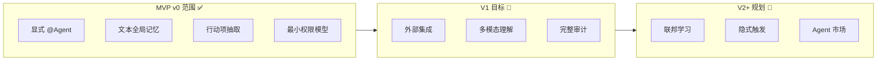
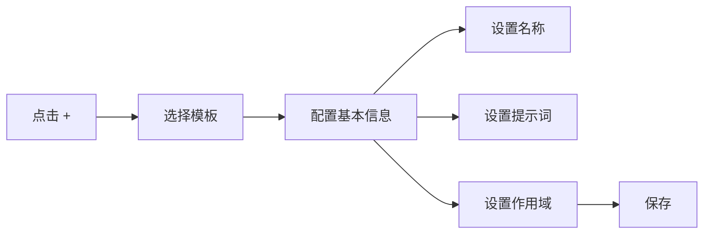
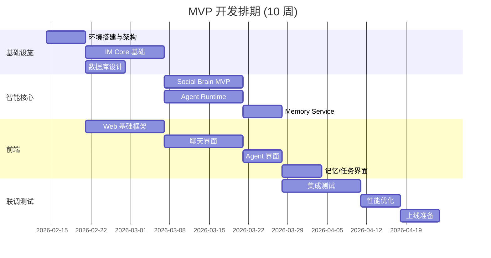

# ClawTeam - MVP 范围定义

> **文档版本**: v1.0
> **创建时间**: 2026-02-14
> **目标周期**: 6-10 周

## 📋 目录

- [1. MVP 原则](#1-mvp-原则)
- [2. 功能边界](#2-功能边界)
- [3. MVP 功能清单](#3-mvp-功能清单)
- [4. 交付计划](#4-交付计划)
- [5. 验收标准](#5-验收标准)

---

## 1. MVP 原则

### 1.1 核心原则

| 原则 | 说明 |
|------|------|
| **验证价值** | 优先验证 "群组智能" 的核心价值 |
| **快速交付** | 6-10 周内可上线试用 |
| **可扩展** | 架构支持后续扩展，不推倒重来 |
| **简化决策** | 减少 AI 决策，用户显式控制 |

### 1.2 MVP 边界图

---

## 2. 功能边界

### 2.1 MVP 做什么 ✅

| 功能 | 描述 | 优先级 |
|------|------|--------|
| **显式 @Agent** | 用户主动 @ 才触发 | P0 |
| **文本记忆** | 全局文本搜索和摘要 | P0 |
| **行动项** | 从对话提取任务 | P0 |
| **基础 Agent** | 2-3 个内置 Agent | P0 |
| **Agent 创建** | GUI 创建自定义 Agent | P1 |
| **手动记忆** | 用户手动 "记一笔" | P1 |

### 2.2 MVP 不做什么 ❌

| 功能 | 原因 | 计划版本 |
|------|------|----------|
| **联邦学习** | 技术复杂度高 | V2 |
| **多模态理解** | 成本高、场景非必需 | V1 |
| **隐式触发** | 用户体验待验证 | V2 |
| **Agent 市场** | 需要生态基础 | V2 |
| **外部写操作** | 风险高、需谨慎 | V1 |
| **视频理解** | 成本高、待验证 | V2 |

### 2.3 MVP vs 完整版对比

| 维度 | MVP | 完整版 |
|------|-----|--------|
| **触发方式** | 仅显式 @ | 显式 + 隐式 |
| **记忆类型** | 文本 | 文本 + 多模态 |
| **Agent 数量** | 2-3 内置 | 无限制 + 社区 |
| **外部集成** | 只读 | 读写集成 |
| **隐私保护** | 基础控制 | 联邦学习 |
| **部署方式** | 云端 | 端云混合 |

---

## 3. MVP 功能清单

### 3.1 核心功能

#### F-001: 群聊基础

| 功能点 | 描述 | 验收标准 |
|--------|------|----------|
| 文本消息 | 发送/接收文本消息 | 消息延迟 < 2s |
| @ 语法 | 支持 @用户 和 @Agent | 语法高亮 |
| 消息引用 | 回复并引用原消息 | 线程展示 |
| 群组管理 | 创建/加入/退出群 | 权限正确 |

#### F-002: Agent 基础

| 功能点 | 描述 | 验收标准 |
|--------|------|----------|
| @Agent 调用 | 输入 @Agent 即可调用 | Agent 正确响应 |
| Agent 回复 | Agent 以群成员身份回复 | 消息格式清晰 |
| 上下文引用 | 显示 Agent 读取的消息 | 可折叠展示 |
| 基础 Agent | 2-3 个内置 Agent | 功能正常 |

**内置 Agent 列表**:

| Agent 名称 | 功能 | 能力 |
|-----------|------|------|
| @SummaryAgent | 总结讨论 | summarize |
| @ResearchAgent | 网络搜索 | search, qa |
| @TaskAgent | 任务管理 | action_item |

#### F-003: 全局记忆

| 功能点 | 描述 | 验收标准 |
|--------|------|----------|
| 自动摘要 | 每 200 条消息生成摘要 | 准确率 > 70% |
| 全局搜索 | 跨群搜索关键词 | 检索延迟 < 300ms |
| 手动标记 | 用户标记重要内容 | 成功标记 |
| 记忆引用 | Agent 回复引用记忆 | 来源可追溯 |

#### F-004: 行动项

| 功能点 | 描述 | 验收标准 |
|--------|------|----------|
| 自动提取 | 从对话提取待办 | 召回率 > 60% |
| 任务创建 | 创建并分配任务 | 任务正确保存 |
| 状态管理 | open/doing/done | 状态正确流转 |
| 群组展示 | 任务列表在群中展示 | UI 正确渲染 |

### 3.2 辅助功能

#### F-005: Agent 创建 (简化版)

| 配置项 | 说明 | MVP 限制 |
|--------|------|----------|
| **Agent 名称** | 唯一标识 | 必填 |
| **提示词** | 行为指令 | 必填 |
| **作用域** | 可访问的群 | 单群/全部 |
| **能力** | 声明的能力 | 从模板选择 |

#### F-006: 权限控制 (最小版)

| 权限项 | 默认值 | 可配置 |
|--------|--------|--------|
| Agent 读群消息 | ✅ 允许 | ❌ |
| Agent 写记忆 | ❌ 关闭 | ✅ |
| Agent 建任务 | ✅ 允许 | ✅ |

### 3.3 界面清单

| 页面 | 功能 | MVP 状态 |
|------|------|----------|
| **聊天页面** | 消息、@Agent、引用 | ✅ 实现 |
| **Agent 管理** | 创建、编辑、删除 Agent | ✅ 实现 |
| **全局搜索** | 跨群搜索 | ✅ 实现 |
| **任务面板** | 任务列表、状态管理 | ✅ 实现 |
| **群设置** | Agent 权限配置 | ✅ 实现 |
| **记忆管理** | 浏览记忆、删除 | 🔮 后续 |
| **Agent 市场** | 发现社区 Agent | ❌ V2 |

---

## 4. 交付计划

### 4.1 周期规划

### 4.2 里程碑

| 里程碑 | 时间 | 交付物 |
|--------|------|--------|
| **M1: 架构冻结** | Week 1 | 架构文档、技术选型确认 |
| **M2: 消息跑通** | Week 3 | 端到端消息收发 |
| **M3: Agent 可用** | Week 5 | @Agent 调用正常 |
| **M4: 记忆上线** | Week 7 | 全局搜索可用 |
| **M5: MVP 完成** | Week 10 | 完整功能，可试运行 |

### 4.3 团队配置

| 角色 | 人数 | 职责 |
|------|------|------|
| **后端工程师** | 2-3 | IM Core, Social Brain, Agent Runtime |
| **前端工程师** | 2 | Web UI, Agent 界面 |
| **AI 工程师** | 1-2 | Agent 模板, Intent 分类, 提示词工程 |
| **SRE** | 1 | 基础设施, 部署, 监控 |
| **PM** | 1 | 需求管理, 优先级决策 |

---

## 5. 验收标准

### 5.1 功能验收

| ID | 验收项 | 标准 |
|----|--------|------|
| **AC-001** | @Agent 调用 | 响应时间 < 5s, 成功率 > 95% |
| **AC-002** | 全局搜索 | 检索延迟 < 300ms (P95) |
| **AC-003** | 自动摘要 | 准确率 > 70% |
| **AC-004** | 任务提取 | 召回率 > 60% |
| **AC-005** | 系统可用性 | 99% SLA |

### 5.2 价值验证

| 指标 | 目标 | 测量方式 |
|------|------|----------|
| **使用率** | > 30% 群使用 Agent | 统计 Agent 调用次数 |
| **留存率** | 7 日留存 > 40% | 用户活跃统计 |
| **记忆价值** | > 20% 搜索被使用 | 搜索使用次数 |
| **任务价值** | > 10% 任务被完成 | 任务完成统计 |

### 5.3 技术债务控制

| 类别 | 限制 |
|------|------|
| **TODO 数量** | < 50 个 |
| **已知 Bug** | P0/P1 = 0 |
| **测试覆盖** | 核心路径 > 70% |
| **文档** | API 文档完整 |

---

## 6. MVP 后续路线

### 6.1 V1 计划 (MVP 后 3-6 个月)

| 功能 | 优先级 |
|------|--------|
| 外部系统集成 (Gmail 读) | P0 |
| 多模态理解 (图片) | P1 |
| 完整审计日志 | P1 |
| 移动端 App | P1 |
| OAuth 集成 | P2 |

### 6.2 V2 计划 (V1 后 6-12 个月)

| 功能 | 优先级 |
|------|--------|
| 联邦学习 | P0 |
| 隐式触发 | P1 |
| Agent 市场 | P1 |
| 视频理解 | P2 |
| 企业版功能 | P2 |

---

## 🏷️ 标签

`#MVP` `#范围定义` `#交付计划` `#验收标准`
