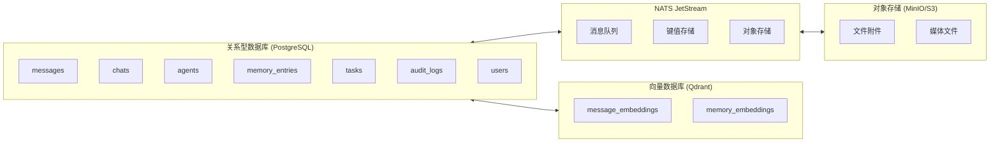

# ClawTeam - 数据模型设计

> **文档版本**: v1.0
> **创建时间**: 2026-02-14
> **数据库**: PostgreSQL (主库) + Qdrant (向量)

## 📋 目录

- [1. 数据库概览](#1-数据库概览)
- [2. 核心表设计](#2-核心表设计)
- [3. 向量存储](#3-向量存储)
- [4. API 设计](#4-api-设计)
- [5. 数据迁移](#5-数据迁移)

---

## 1. 数据库概览

### 1.1 数据存储架构



### 1.2 表分类

| 类别 | 表名 | 用途 |
|------|------|------|
| **用户与群组** | users, chats, chat_members | 基础社交关系 |
| **消息** | messages, attachments | 消息存储 |
| **Agent** | agents, agent_capabilities, agent_configs | Agent 管理 |
| **记忆** | memory_entries, memory_tags, memory_links | 全局记忆 |
| **任务** | tasks, task_assignments | 任务管理 |
| **审计** | audit_logs, approvals | 审计追踪 |

---

## 2. 核心表设计

### 2.1 用户与群组

#### users

```sql
CREATE TABLE users (
    -- 主键
    id              UUID PRIMARY KEY DEFAULT gen_random_uuid(),

    -- 基本信息
    username        VARCHAR(32) UNIQUE NOT NULL,
    display_name    VARCHAR(128) NOT NULL,
    email           VARCHAR(255) UNIQUE,
    phone           VARCHAR(32),

    -- 认证
    password_hash   VARCHAR(255),  -- bcrypt
    avatar_url      VARCHAR(512),

    -- 状态
    status          VARCHAR(16) DEFAULT 'active',  -- active, suspended, deleted
    created_at      TIMESTAMPTZ DEFAULT NOW(),
    updated_at      TIMESTAMPTZ DEFAULT NOW(),
    last_seen_at    TIMESTAMPTZ,

    -- 索引
    CONSTRAINT status_check CHECK (status IN ('active', 'suspended', 'deleted'))
);

CREATE INDEX idx_users_username ON users(username);
CREATE INDEX idx_users_email ON users(email);
CREATE INDEX idx_users_status ON users(status) WHERE status != 'active';
```

#### chats

```sql
CREATE TYPE chat_type AS ENUM ('direct', 'group', 'channel');

CREATE TABLE chats (
    -- 主键
    id              UUID PRIMARY KEY DEFAULT gen_random_uuid(),

    -- 基本信息
    type            chat_type NOT NULL,
    name            VARCHAR(128),  -- 群名 (private/group 可选)
    description     TEXT,

    -- 群组设置
    avatar_url      VARCHAR(512),
    is_public       BOOLEAN DEFAULT false,

    -- Agent 设置
    agent_memory_enabled BOOLEAN DEFAULT false,  -- Agent 是否可写记忆
    default_agents  JSONB DEFAULT '[]'::jsonb,      -- 默认启用的 Agent IDs

    -- 元数据
    metadata        JSONB DEFAULT '{}'::jsonb,
    created_by      UUID REFERENCES users(id),

    -- 时间戳
    created_at      TIMESTAMPTZ DEFAULT NOW(),
    updated_at      TIMESTAMPTZ DEFAULT NOW(),

    -- 软删除
    deleted_at      TIMESTAMPTZ
);

CREATE INDEX idx_chats_type ON chats(type);
CREATE INDEX idx_chats_created_by ON chats(created_by);
CREATE INDEX idx_chats_deleted_at ON chats(deleted_at) WHERE deleted_at IS NULL;
```

#### chat_members

```sql
CREATE TYPE member_role AS ENUM ('owner', 'admin', 'member');

CREATE TABLE chat_members (
    -- 复合主键
    chat_id         UUID REFERENCES chats(id) ON DELETE CASCADE,
    user_id         UUID REFERENCES users(id) ON DELETE CASCADE,

    -- 成员信息
    role            member_role DEFAULT 'member',
    display_name    VARCHAR(128),  -- 群内昵称

    -- 通知设置
    mute_until      TIMESTAMPTZ,
    mention_enabled BOOLEAN DEFAULT true,

    -- 时间戳
    joined_at       TIMESTAMPTZ DEFAULT NOW(),
    updated_at      TIMESTAMPTZ DEFAULT NOW(),

    -- 主键约束
    PRIMARY KEY (chat_id, user_id)
);

CREATE INDEX idx_chat_members_user_id ON chat_members(user_id);
CREATE INDEX idx_chat_members_role ON chat_members(role);
```

### 2.2 消息

#### messages

```sql
CREATE TYPE sender_type AS ENUM ('user', 'agent', 'system');

CREATE TABLE messages (
    -- 主键
    id              UUID PRIMARY KEY DEFAULT gen_random_uuid(),

    -- 关联
    chat_id         UUID NOT NULL REFERENCES chats(id) ON DELETE CASCADE,

    -- 发送者
    sender_type     sender_type NOT NULL,
    sender_id       VARCHAR(128) NOT NULL,  -- user UUID or agent_id

    -- 内容
    content_type    VARCHAR(32) DEFAULT 'text',  -- text, image, video, file
    content         TEXT NOT NULL,

    -- 关联
    reply_to        UUID REFERENCES messages(id),  -- 回复的消息
    thread_root     UUID REFERENCES messages(id),  -- 线程根消息

    -- 附件
    attachments     JSONB DEFAULT '[]'::jsonb,

    -- 元数据
    mentions        JSONB DEFAULT '[]'::jsonb,     -- @users, @agents
    metadata        JSONB DEFAULT '{}'::jsonb,

    -- 状态
    is_deleted      BOOLEAN DEFAULT false,
    deleted_at      TIMESTAMPTZ,

    -- 时间戳
    created_at      TIMESTAMPTZ DEFAULT NOW(),
    updated_at      TIMESTAMPTZ DEFAULT NOW(),

    -- 全文搜索
    tsv             TSVECTOR GENERATED ALWAYS AS (to_tsvector('english', content)) STORED
);

CREATE INDEX idx_messages_chat_id_created_at ON messages(chat_id, created_at DESC);
CREATE INDEX idx_messages_sender ON messages(sender_type, sender_id);
CREATE INDEX idx_messages_reply_to ON messages(reply_to) WHERE reply_to IS NOT NULL;
CREATE INDEX idx_messages_thread_root ON messages(thread_root) WHERE thread_root IS NOT NULL;
CREATE INDEX idx_messages_tsv ON messages USING GIN(tsv);
CREATE INDEX idx_messages_deleted_at ON messages(deleted_at) WHERE deleted_at IS NULL;
```

### 2.3 Agent

#### agents

```sql
CREATE TYPE agent_template AS ENUM ('summary', 'research', 'task', 'custom');

CREATE TABLE agents (
    -- 主键
    id              VARCHAR(64) PRIMARY KEY,  -- 如: summary_agent, user_abc_agent

    -- 基本信息
    name            VARCHAR(128) NOT NULL,
    description     TEXT,
    template        agent_template NOT NULL,

    -- 所有者
    owner_id        UUID REFERENCES users(id),

    -- 配置
    system_prompt    TEXT NOT NULL,
    model_config    JSONB NOT NULL,  -- model_name, temperature, max_tokens, etc.

    -- 能力声明
    capabilities    JSONB NOT NULL DEFAULT '[]'::jsonb,  -- ["summarize", "search"]

    -- 作用域
    scope_type      VARCHAR(16) DEFAULT 'selected',  -- all, selected
    scope_chats     JSONB DEFAULT '[]'::jsonb,        -- 可访问的 chat_ids

    -- 权限
    can_write_memory BOOLEAN DEFAULT false,
    can_create_tasks BOOLEAN DEFAULT true,
    can_external_action BOOLEAN DEFAULT false,

    -- 外部集成
    external_tools  JSONB DEFAULT '[]'::jsonb,  -- [{type: "gmail", scopes: ["read"]}]

    -- 状态
    is_active       BOOLEAN DEFAULT true,
    is_public       BOOLEAN DEFAULT false,

    -- 统计
    usage_count     BIGINT DEFAULT 0,

    -- 时间戳
    created_at      TIMESTAMPTZ DEFAULT NOW(),
    updated_at      TIMESTAMPTZ DEFAULT NOW(),

    -- 软删除
    deleted_at      TIMESTAMPTZ
);

CREATE INDEX idx_agents_owner_id ON agents(owner_id);
CREATE INDEX idx_agents_template ON agents(template);
CREATE INDEX idx_agents_is_active ON agents(is_active) WHERE is_active = true;
CREATE INDEX idx_agents_deleted_at ON agents(deleted_at) WHERE deleted_at IS NULL;
```

#### agent_stats

```sql
CREATE TABLE agent_stats (
    -- 主键
    id              BIGSERIAL PRIMARY KEY,

    -- Agent
    agent_id        VARCHAR(64) REFERENCES agents(id) ON DELETE CASCADE,

    -- 统计窗口 (按天)
    date            DATE NOT NULL,

    -- 统计指标
    call_count      BIGINT DEFAULT 0,
    success_count   BIGINT DEFAULT 0,
    error_count     BIGINT DEFAULT 0,

    -- Token 使用
    total_input_tokens  BIGINT DEFAULT 0,
    total_output_tokens BIGINT DEFAULT 0,

    -- 成本
    total_cost      NUMERIC(10, 4) DEFAULT 0,

    -- 用户满意度
    avg_satisfaction NUMERIC(3, 2),  -- 0.00 - 5.00

    -- 时间戳
    created_at      TIMESTAMPTZ DEFAULT NOW(),
    updated_at      TIMESTAMPTZ DEFAULT NOW(),

    -- 唯一约束
    UNIQUE (agent_id, date)
);

CREATE INDEX idx_agent_stats_agent_id_date ON agent_stats(agent_id, date DESC);
```

### 2.4 记忆

#### memory_entries

```sql
CREATE TYPE memory_type AS ENUM ('summary', 'decision', 'action', 'knowledge');
CREATE TYPE memory_scope AS ENUM ('global', 'chat', 'user');
CREATE TYPE memory_status AS ENUM ('active', 'deprecated', 'deleted');

CREATE TABLE memory_entries (
    -- 主键
    id              UUID PRIMARY KEY DEFAULT gen_random_uuid(),

    -- 类型
    type            memory_type NOT NULL,
    scope           memory_scope NOT NULL,

    -- 关联
    chat_id         UUID REFERENCES chats(id) ON DELETE CASCADE,
    user_id         UUID REFERENCES users(id) ON DELETE CASCADE,  -- 创建者

    -- 内容
    title           VARCHAR(256),
    summary_text    TEXT NOT NULL,
    content         TEXT,

    -- 来源
    source_type     VARCHAR(16),  -- message, agent, manual
    source_id       VARCHAR(128),
    source_message_ids JSONB DEFAULT '[]'::jsonb,

    -- 组织
    tags            JSONB DEFAULT '[]'::jsonb,
    links           JSONB DEFAULT '[]'::jsonb,  -- 关联的其他记忆

    -- 向量 (存储 embedding)
    embedding_id    VARCHAR(128),  -- 指向向量数据库

    -- 生命周期
    status          memory_status DEFAULT 'active',
    expires_at      TIMESTAMPTZ,

    -- 访问统计
    access_count    INT DEFAULT 0,

    -- 时间戳
    created_at      TIMESTAMPTZ DEFAULT NOW(),
    updated_at      TIMESTAMPTZ DEFAULT NOW()
);

CREATE INDEX idx_memory_entries_type ON memory_entries(type);
CREATE INDEX idx_memory_entries_scope ON memory_entries(scope);
CREATE INDEX idx_memory_entries_chat_id ON memory_entries(chat_id) WHERE chat_id IS NOT NULL;
CREATE INDEX idx_memory_entries_user_id ON memory_entries(user_id) WHERE user_id IS NOT NULL;
CREATE INDEX idx_memory_entries_status ON memory_entries(status) WHERE status = 'active';
CREATE INDEX idx_memory_entries_created_at ON memory_entries(created_at DESC);

-- 全文搜索
CREATE INDEX idx_memory_entries_summary_tsv ON memory_entries
    USING GIN(to_tsvector('english', summary_text));
```

#### memory_tags

```sql
CREATE TABLE memory_tags (
    id              SERIAL PRIMARY KEY,
    name            VARCHAR(64) UNIQUE NOT NULL,
    description     TEXT,
    usage_count     INT DEFAULT 0,
    created_at      TIMESTAMPTZ DEFAULT NOW()
);

CREATE INDEX idx_memory_tags_name ON memory_tags(name);
CREATE INDEX idx_memory_tags_usage ON memory_tags(usage_count DESC);
```

### 2.5 任务

#### tasks

```sql
CREATE TYPE task_status AS ENUM ('open', 'in_progress', 'done', 'cancelled');
CREATE TYPE task_priority AS ENUM ('low', 'medium', 'high', 'urgent');

CREATE TABLE tasks (
    -- 主键
    id              UUID PRIMARY KEY DEFAULT gen_random_uuid(),

    -- 关联
    chat_id         UUID NOT NULL REFERENCES chats(id) ON DELETE CASCADE,

    -- 基本信息
    title           VARCHAR(256) NOT NULL,
    description     TEXT,

    -- 分配
    assignee_id     UUID REFERENCES users(id),
    agent_id        VARCHAR(64) REFERENCES agents(id),  -- 由哪个 Agent 创建

    -- 来源
    source_message_id UUID REFERENCES messages(id),

    -- 状态
    status          task_status DEFAULT 'open',
    priority        task_priority DEFAULT 'medium',

    -- 时间
    due_date        TIMESTAMPTZ,
    completed_at    TIMESTAMPTZ,

    -- 元数据
    metadata        JSONB DEFAULT '{}'::jsonb,

    -- 时间戳
    created_at      TIMESTAMPTZ DEFAULT NOW(),
    updated_at      TIMESTAMPTZ DEFAULT NOW()
);

CREATE INDEX idx_tasks_chat_id ON tasks(chat_id);
CREATE INDEX idx_tasks_assignee_id ON tasks(assignee_id) WHERE assignee_id IS NOT NULL;
CREATE INDEX idx_tasks_status ON tasks(status);
CREATE INDEX idx_tasks_due_date ON tasks(due_date) WHERE due_date IS NOT NULL;
CREATE INDEX idx_tasks_created_at ON tasks(created_at DESC);
```

### 2.6 审计

#### audit_logs

```sql
CREATE TABLE audit_logs (
    -- 主键
    id              BIGSERIAL PRIMARY KEY,

    -- 操作者
    actor_type      VARCHAR(16) NOT NULL,  -- user, agent, system
    actor_id        VARCHAR(128) NOT NULL,

    -- 操作
    action          VARCHAR(64) NOT NULL,
    category        VARCHAR(32),  -- message, memory, task, agent

    -- 目标
    target_type     VARCHAR(32),
    target_id       VARCHAR(128),

    -- 内容哈希 (防篡改)
    payload_hash    VARCHAR(64),

    -- 详情
    details         JSONB DEFAULT '{}'::jsonb,

    -- 溯源
    provenance      JSONB DEFAULT '[]'::jsonb,  -- 来源 IDs

    -- 结果
    result          VARCHAR(16),  -- success, failure, partial

    -- 时间戳
    timestamp       TIMESTAMPTZ DEFAULT NOW()
);

CREATE INDEX idx_audit_logs_actor ON audit_logs(actor_type, actor_id);
CREATE INDEX idx_audit_logs_action ON audit_logs(action);
CREATE INDEX idx_audit_logs_target ON audit_logs(target_type, target_id);
CREATE INDEX idx_audit_logs_timestamp ON audit_logs(timestamp DESC);
CREATE INDEX idx_audit_logs_result ON audit_logs(result);
```

#### approvals

```sql
CREATE TYPE approval_status AS ENUM ('pending', 'approved', 'rejected', 'expired');

CREATE TABLE approvals (
    -- 主键
    id              UUID PRIMARY KEY DEFAULT gen_random_uuid(),

    -- 请求者
    requester_id    UUID REFERENCES users(id) NOT NULL,
    requester_type   VARCHAR(16) NOT NULL,  -- user, agent

    -- 审批者
    approver_id     UUID REFERENCES users(id),

    -- 审批内容
    title           VARCHAR(256) NOT NULL,
    description     TEXT NOT NULL,

    -- 关联的操作
    target_action   JSONB NOT NULL,  -- {agent_id, action, params}

    -- 状态
    status          approval_status DEFAULT 'pending',

    -- 有效期
    expires_at      TIMESTAMPTZ NOT NULL,

    -- 决策
    decided_at      TIMESTAMPTZ,
    decision_reason  TEXT,

    -- 时间戳
    created_at      TIMESTAMPTZ DEFAULT NOW()
);

CREATE INDEX idx_approvals_requester ON approvals(requester_id, status);
CREATE INDEX idx_approvals_approver ON approvals(approver_id, status);
CREATE INDEX idx_approvals_status ON approvals(status);
CREATE INDEX idx_approvals_expires_at ON approvals(expires_at) WHERE status = 'pending';
```

---

## 3. 向量存储

### 3.1 Qdrant Collections

#### messages_embeddings

```json
{
  "collection_name": "messages_embeddings",
  "vectors": {
    "size": 1536,
    "distance": "Cosine"
  },
  "payload_schema": {
    "message_id": "uuid",
    "chat_id": "uuid",
    "content": "text",
    "sender_type": "keyword",
    "sender_id": "text",
    "created_at": "integer"
  }
}
```

#### memory_embeddings

```json
{
  "collection_name": "memory_embeddings",
  "vectors": {
    "size": 1536,
    "distance": "Cosine"
  },
  "payload_schema": {
    "memory_id": "uuid",
    "type": "keyword",
    "scope": "keyword",
    "chat_id": "uuid",
    "summary_text": "text",
    "tags": "array",
    "created_at": "integer"
  }
}
```

### 3.2 向量操作

```python
class VectorStore:
    """
    向量存储抽象
    """

    async def search_messages(
        self,
        query_embedding: List[float],
        chat_id: Optional[str] = None,
        limit: int = 10,
        score_threshold: float = 0.7
    ) -> List[SearchResult]:
        """搜索相似消息"""
        pass

    async def search_memories(
        self,
        query_embedding: List[float],
        scope: MemoryScope = MemoryScope.GLOBAL,
        memory_types: Optional[List[MemoryType]] = None,
        limit: int = 10
    ) -> List[SearchResult]:
        """搜索相似记忆"""
        pass

    async def upsert_message(
        self,
        message_id: str,
        embedding: List[float],
        payload: Dict
    ) -> str:
        """插入/更新消息向量"""
        pass

    async def upsert_memory(
        self,
        memory_id: str,
        embedding: List[float],
        payload: Dict
    ) -> str:
        """插入/更新记忆向量"""
        pass
```

---

## 4. API 设计

### 4.1 API 版本

```
Base URL: https://api.clawteam.com/v1
```

### 4.2 核心 API

#### 消息相关

| 方法 | 端点 | 描述 |
|------|------|------|
| POST | /chats/{chat_id}/messages | 发送消息 |
| GET | /chats/{chat_id}/messages | 获取消息列表 |
| PATCH | /messages/{message_id} | 编辑消息 |
| DELETE | /messages/{message_id} | 删除消息 |

#### Agent 相关

| 方法 | 端点 | 描述 |
|------|------|------|
| GET | /agents | 获取 Agent 列表 |
| POST | /agents | 创建 Agent |
| GET | /agents/{agent_id} | 获取 Agent 详情 |
| PATCH | /agents/{agent_id} | 更新 Agent |
| DELETE | /agents/{agent_id} | 删除 Agent |
| POST | /agents/{agent_id}/invoke | 手动调用 Agent |

#### 记忆相关

| 方法 | 端点 | 描述 |
|------|------|------|
| GET | /memory/search | 全局搜索 |
| POST | /memory/entries | 创建记忆条目 |
| GET | /memory/entries/{id} | 获取记忆详情 |
| PATCH | /memory/entries/{id} | 更新记忆 |
| DELETE | /memory/entries/{id} | 删除记忆 |
| GET | /memory/tags | 获取标签列表 |

#### 任务相关

| 方法 | 端点 | 描述 |
|------|------|------|
| GET | /tasks | 获取任务列表 |
| POST | /tasks | 创建任务 |
| GET | /tasks/{id} | 获取任务详情 |
| PATCH | /tasks/{id} | 更新任务 |
| DELETE | /tasks/{id} | 删除任务 |

#### 审批相关

| 方法 | 端点 | 描述 |
|------|------|------|
| GET | /approvals | 获取待审批列表 |
| POST | /approvals/{id}/approve | 批准 |
| POST | /approvals/{id}/reject | 拒绝 |

### 4.3 API 请求示例

#### 发送消息

```http
POST /v1/chats/{chat_id}/messages HTTP/1.1
Content-Type: application/json
Authorization: Bearer {token}

{
  "content": "@SummaryAgent 帮我总结今天的讨论",
  "reply_to": null
}
```

#### 搜索记忆

```http
GET /v1/memory/search?q=roadmap&scope=global&limit=10 HTTP/1.1
Authorization: Bearer {token}
```

#### 创建 Agent

```http
POST /v1/agents HTTP/1.1
Content-Type: application/json
Authorization: Bearer {token}

{
  "name": "My Agent",
  "template": "custom",
  "system_prompt": "You are a helpful assistant...",
  "model_config": {
    "model": "claude-3-5-sonnet",
    "temperature": 0.7,
    "max_tokens": 2000
  },
  "capabilities": ["qa", "summarize"],
  "scope_type": "selected",
  "scope_chats": ["{chat_id}"],
  "can_write_memory": false,
  "can_create_tasks": true
}
```

---

## 5. 数据迁移

### 5.1 迁移策略


### 5.2 迁移工具

```bash
# 使用 golang-migrate
migrate create -ext sql -dir migrations -seq create_users_table

# 执行迁移
migrate -path migrations -database "postgres://..." up

# 回滚
migrate -path migrations -database "postgres://..." down 1
```

### 5.3 数据备份策略

| 类型 | 频率 | 保留期 |
|------|------|--------|
| **全量备份** | 每天 | 30 天 |
| **增量备份** | 每小时 | 7 天 |
| **WAL 归档** | 实时 | 90 天 |

---

## 🏷️ 标签

`#数据模型` `#数据库设计` `#API设计` `#PostgreSQL` `#Qdrant`
