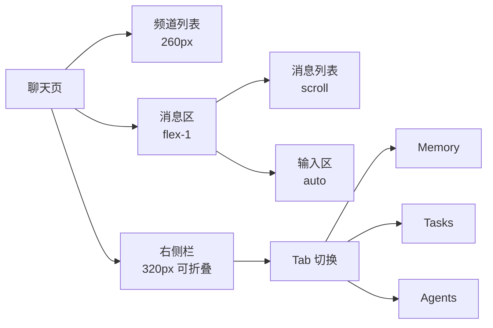

# ClawTeam - UI 设计规格

> **文档版本**: v1.0
> **创建时间**: 2026-02-14
> **设计方向**: IM 原生 + AI 结构化卡片

## 📋 目录

- [1. 设计理念](#1-设计理念)
- [2. 设计系统](#2-设计系统)
- [3. 核心页面](#3-核心页面)
- [4. 组件设计](#4-组件设计)
- [5. 交互细节](#5-交互细节)

---

## 1. 设计理念

### 1.1 核心原则

| 原则 | 说明 | 反例（避免） |
|------|------|----------|
| **对话为主** | AI 是群成员，不是主导者 | 满屏 AI 按钮 |
| **结构化输出** | AI 结果用卡片/块状呈现 | ChatGPT 式大段文字 |
| **可信可溯** | 每个结论都有来源 | 无引用的断言 |
| **克制优雅** | 留白、轻阴影、圆角适中 | 赛博朋克、重阴影 |
| **可控感** | 用户掌握最终决定权 | AI 自动执行无确认 |

### 1.2 视觉基调

```
┌─────────────────────────────────────────────────────────────┐
│                      视觉关键词                           │
├─────────────────────────────────────────────────────────────┤
│                                                               │
│    干净 ────────► 大量留白、信息密度适中                      │
│    克制 ────────► 动效少、配色克制、无多余装饰                   │
│    可信 ────────► 结构清晰、来源可溯、审批流程明确               │
│    落地 ────────► AI 输出可直接转为任务/记忆                     │
│                                                               │
└─────────────────────────────────────────────────────────────┘
```

### 1.3 方向选择：企业协作风

**理由**: 核心壁垒是"生产力闭环 + 审计可信"，企业风更容易建立信任

| 特征 | 表现 |
|------|------|
| **底色** | 灰白底 (#F5F7FA 背景，#FFFFFF 卡片) |
| **信息密度** | 中高，类似飞书/Linear |
| **卡片风格** | 硬朗、边界清晰 |
| **动效** | 最少化，功能性过渡 |
| **主色** | 专业蓝 (#0066CC) 或深邃紫 (#5B4B9E) |

---

## 2. 设计系统

### 2.1 设计 Tokens

#### 色彩系统

```yaml
# 主色（品牌色）
primary:
  main:     "#0066CC"   # 主要操作、@Agent 高亮
  light:    "#3388DD"   # hover 状态
  lighter:  "#E6F2FF"   # 背景点缀
  dark:     "#004C99"    # 激活状态

# 中性色（灰阶）
gray:
  50:  "#FAFAFA"   # 页面背景
  100: "#F5F7FA"   # 卡片背景、次要背景
  200: "#E8EDF3"   # 分割线、边框
  300: "#CBD5E1"   # 禁用状态、次要图标
  400: "#94A3B8"   # 次要文字、占位符
  500: "#64748B"   # 正文、主图标
  600: "#475569"   # 标题
  700: "#334155"   # 重要标题
  800: "#1E293B"   # 重要强调
  900: "#0F172A"   # 最重要文字

# 语义色
success:
  main:   "#10B981"   # 成功、完成
  bg:     "#D1FAE5"   # 成功背景

warning:
  main:   "#F59E0B"   # 警告、需确认
  bg:     "#FEF3C7"   # 警告背景

danger:
  main:   "#EF4444"   # 危险、拒绝
  bg:     "#FEE2E2"   # 危险背景

info:
  main:   "#3B82F6"   # 信息提示
  bg:     "#DBEAFE"   # 信息背景
```

#### 字体系统

```yaml
# 字体族
font_family:
  base:    '"SF Pro Text", -apple-system, BlinkMacSystemFont, "Segoe UI", Roboto, sans-serif'
  mono:    '"SF Mono", "JetBrains Mono", Consolas, monospace'
  chinese: '"PingFang SC", "Hiragino Sans GB", "Microsoft YaHei", sans-serif'

# 字号
font_size:
  xs:      "12px"    # 辅助说明
  sm:      "13px"    # 次要信息
  base:    "14px"    # 正文
  lg:      "16px"    # 小标题
  xl:      "18px"    # 标题
  "2xl":   "20px"    # 大标题
  "3xl":   "24px"    # 页面主标题
  "4xl":   "30px"    # 特大标题

# 字重
font_weight:
  normal:  400
  medium:  500
  semibold: 600
  bold:    700
```

#### 间距系统

```yaml
# 基于 4px 栅格
spacing:
  0:   "0px"
  1:   "4px"
  2:   "8px"      # 元素内紧凑间距
  3:   "12px"     # 卡片内边距
  4:   "16px"     # 常规间距、卡片外边距
  5:   "20px"     # 区域间距
  6:   "24px"     # 大区域间距
  8:   "32px"     # 页面级间距
  12:  "48px"     # 页面边距
  16:  "64px"     # 大页面边距
```

#### 圆角系统

```yaml
border_radius:
  sm:   "4px"      # 小元素（标签、徽章）
  base: "8px"      # 按钮、输入框、卡片（默认）
  lg:   "12px"     # 大卡片、模态框
  xl:   "16px"     # 特大卡片
  full: "9999px"   # 胶囊/圆形元素
```

#### 阴影系统

```yaml
# 极轻阴影（推荐）
shadow:
  sm:   "0 1px 2px rgba(15, 23, 42, 0.04)"
  base: "0 2px 8px rgba(15, 23, 42, 0.06)"
  lg:   "0 8px 16px rgba(15, 23, 42, 0.08)"
  xl:   "0 16px 32px rgba(15, 23, 42, 0.10)"
```

### 2.2 布局系统

```
┌─────────────────────────────────────────────────────────────────┐
│  Header (48px)                                               │
│  [Logo] [Search]           [通知] [头像]                       │
├──────────┬────────────────────────────────────────────────────┤
│          │                                                     │
│ Channel  │  Chat Area                        │  Right Panel │
│ List    │                                                     │
│ (260px) │  ┌─────────────────────────────────────┐    │  (320px)  │
│          │  │  Messages                              │    │           │
│          │  │                                         │    │  ┌─────┐  │
│          │  │  ┌─────────────────────────────────┐  │    │  │ Tab │  │
│          │  │  │ User Message                   │  │    │  ├─────┤  │
│          │  │  └─────────────────────────────────┘  │    │  │ Mm  │  │
│          │  │                                         │    │  │     │  │
│          │  │  ┌─────────────────────────────────┐  │    │  │ Tk  │  │
│          │  │  │ Agent Card                      │  │    │  │     │  │
│          │  │  │ ┌─────────────────────────────┐│  │    │  │     │  │
│          │  │  │ │ [结论]                        ││  │    │  └─────┘  │
│          │  │  │ │ [行动项]                      ││  │    │           │
│          │  │  │ │ [更多细节 ▼]                 ││  │    │  [Input]   │
│          │  │  │ └─────────────────────────────┘│  │    │           │
│          │  │  │ 引用 12 条 | 创建 3 任务        │  │    │           │
│          │  │  └─────────────────────────────────┘  │    │           │
│          │  │                                         │    │           │
│          │  └─────────────────────────────────────┘    │           │
│          │                                                     │
└──────────┴─────────────────────────────────────────────────────┘
```

---

## 3. 核心页面

### 3.1 聊天页面 (Chat)

#### 布局结构



#### 消息样式对比

```
┌─────────────────────────────────────────────────────────────┐
│                    人类消息样式                             │
├─────────────────────────────────────────────────────────────┤
│                                                               │
│  [头像]                                    王小明  2:30 PM │
│  我们下周要做一个 AI 社交平台的 demo，需要准备幻灯片       │
│  和演示脚本。                                                  │
│                                                               │
│  ─────────────────────────────────────────────────────────  │
│                                                               │
│  [SA]                        @SummaryAgent         2:31 PM │
│  ┌─────────────────────────────────────────────────────────┐ │
│  │  📋 路演材料准备                                           │ │
│  │                                                          │ │
│  │  ✅ 结论：需要准备幻灯片 + 演示脚本两部分                   │ │
│  │                                                          │ │
│  │  📝 行动项 (3)                                           │ │
│  │  ☐ 幻灯片设计 — 李四                                      │ │
│  │  ☐ Demo 录屏 — 王五                                      │ │
│  │  ☐ 演示脚本 — 张三                                      │ │
│  │                                                          │ │
│  │  ─────────────────────────────────────────────────────   │ │
│  │  ▼ 更多细节                                               │ │
│  │  ┌──────────────────────────────────────────────────┐  │ │
│  │  │ 幻灯片大纲：                                       │  │ │
│  │  │ 1. 问题背景 (2 页)                                  │  │ │
│  │  │ 2. 核心功能 (5 页)                                   │  │ │
│  │  │ 3. 技术架构 (3 页)                                   │  │ │
│  │  │ 4. Demo 展示 (2 页)                                  │  │ │
│  │  └──────────────────────────────────────────────────┘  │ │
│  │                                                          │ │
│  │  引用 12 条上下文 · 创建 3 个任务 · 写入 1 条记忆      │ │
│  └─────────────────────────────────────────────────────────┘ │
│                                                               │
└─────────────────────────────────────────────────────────────┘
```

### 3.2 全局记忆页面 (Memory)

#### 卡片样式

```
┌─────────────────────────────────────────────────────────────┐
│                        记忆卡片                             │
├─────────────────────────────────────────────────────────────┤
│                                                               │
│  🏷️ 项目决策：ClawTeam MVP 范围                              │
│  ─────────────────────────────────────────────────────────  │
│                                                               │
│  MVP 将聚焦 3 个核心功能：                                      │
│  • 显式 @Agent 调用                                         │
│  • 文本全局记忆（暂不支持多模态）                               │
│  • 行动项自动抽取                                            │
│                                                               │
│  ─────────────────────────────────────────────────────────  │
│  来自：产品组群聊 · 3 天前                                    │
│  标签：#MVP #规划 #决策                                      │
│                                                               │
│  [跳转到原消息]                                               │
│                                                               │
└─────────────────────────────────────────────────────────────┘
```

#### 筛选栏

```
┌─────────────────────────────────────────────────────────────┐
│  🔍 搜索记忆...        [类型▼] [时间▼]          [+ 新建]  │
├─────────────────────────────────────────────────────────────┤
│  类型: [全部] [总结] [决策] [行动] [知识]                   │
│  时间: [全部] [今天] [本周] [本月] [自定义]                   │
│  群组: [全部群] ▼                                           │
└─────────────────────────────────────────────────────────────┘
```

### 3.3 任务页面 (Tasks)

#### 任务列表

```
┌─────────────────────────────────────────────────────────────┐
│  📋 任务                                    [+ 新建任务]  │
├─────────────────────────────────────────────────────────────┤
│                                                               │
│  [全部] [进行中] [已完成]                       [排序▼]     │
│                                                               │
│  ┌─────────────────────────────────────────────────────┐   │
│  │ ☐ 幻灯片设计                              高        │   │
│  │    产品组 · 负责人：李四 · 截止：明天 18:00       │   │
│  │    来自：@SummaryAgent 的总结                      │   │
│  │    [查看原消息]                                    │   │
│  └─────────────────────────────────────────────────────┘   │
│                                                               │
│  ┌─────────────────────────────────────────────────────┐   │
│  │ ☐ Demo 录屏                              中        │   │
│  │    产品组 · 负责人：王五 · 截止：后天 12:00       │   │
│  │    来自：@PMOAgent 自动创建                       │   │
│  │    [查看原消息]                                    │   │
│  └─────────────────────────────────────────────────────┘   │
│                                                               │
│  ┌─────────────────────────────────────────────────────┐   │
│  │ ☑ 演示脚本                              低        │   │
│  │    产品组 · 负责人：张三 · 已于 2 小时前完成      │   │
│  └─────────────────────────────────────────────────────┘   │
│                                                               │
└─────────────────────────────────────────────────────────────┘
```

### 3.4 审批页面 (Approval)

#### 待审批列表

```
┌─────────────────────────────────────────────────────────────┐
│  ⚠️ 待审批 (2)                                      [全部]  │
├─────────────────────────────────────────────────────────────┤
│                                                               │
│  ┌─────────────────────────────────────────────────────┐   │
│  │  ⚠️ @ResearchAgent 要执行外部操作                        │   │
│  │  ────────────────────────────────────────────────  │   │
│  │                                                         │   │
│  │  操作：发送邮件                                           │   │
│  │  收件人：team@example.com                               │   │
│  │  主题：竞品分析报告                                       │   │
│  │                                                         │   │
│  │  影响范围：使用你的 Gmail 账户发送                       │   │
│  │  来源：产品组群聊 · @SummaryAgent 触发                   │   │
│  │                                                         │   │
│  │  ────────────────────────────────────────────────  │   │
│  │  [拒绝]  [允许一次]  [总是允许此操作]              │   │
│  └─────────────────────────────────────────────────────┘   │
│                                                               │
│  ┌─────────────────────────────────────────────────────┐   │
│  │  ⚠️ @SummaryAgent 要写入全局记忆                        │   │
│  │  ────────────────────────────────────────────────  │   │
│  │                                                         │   │
│  │  记忆类型：项目决策                                       │   │
│  │  内容：MVP 范围确定...                                   │   │
│  │                                                         │   │
│  │  来源：产品组群聊今天的讨论                               │   │
│  │                                                         │   │
│  │  ────────────────────────────────────────────────  │   │
│  │  [拒绝]  [允许]                                       │   │
│  └─────────────────────────────────────────────────────┘   │
│                                                               │
└─────────────────────────────────────────────────────────────┘
```

---

## 4. 组件设计

### 4.1 Agent 消息卡片

#### 结构分解

```
┌─────────────────────────────────────────────────────────────┐
│  [Agent 头像 + Badge]                    [时间] [操作⋮]    │
├─────────────────────────────────────────────────────────────┤
│                                                               │
│  ┌───────────────────────────────────────────────────────┐  │
│  │  📋 [标题/结论]                                        │  │
│  │  ───────────────────────────────────────────────────── │  │
│  │                                                         │  │
│  │  📝 行动项 (3)                                         │  │
│  │  ┌─────────────────────────────────────────────────┐ │  │
│  │  │ ☐ 任务 1                    [重新分配▼] [详情]  │ │  │
│  │  │ ☐ 任务 2                    [重新分配▼] [详情]  │ │  │
│  │  │ ☐ 任务 3                    [重新分配▼] [详情]  │ │  │
│  │  └─────────────────────────────────────────────────┘ │  │
│  │                                                         │  │
│  │  ▼ 更多细节                                            │  │
│  │  ┌─────────────────────────────────────────────────┐ │  │
│  │  │ [可折叠的详细内容...]                            │ │  │
│  │  │                                               │ │  │
│  │  └─────────────────────────────────────────────────┘ │  │
│  │                                                         │  │
│  │  ───────────────────────────────────────────────────── │  │
│  │  引用 12 条上下文 · 创建 3 个任务 · 写入 1 条记忆    │  │
│  └───────────────────────────────────────────────────────┘  │
│                                                               │
│  [👍 有帮助]  [👎 不准确]  [📌 保存到记忆]                 │
│                                                               │
└─────────────────────────────────────────────────────────────┘
```

#### 状态变体

| 状态 | 视觉表现 |
|------|----------|
| **进行中** | spinner 动画 + "思考中..." |
| **成功** | 正常卡片显示 |
| **部分成功** | 警告色边框 + "部分完成" 提示 |
| **失败** | 危险色边框 + 错误信息 |
| **需审批** | 锁定图标 + "等待你的批准" |

### 4.2 Approval 卡片

#### 基础样式

```
┌─────────────────────────────────────────────────────────────┐
│  ⚠️ 待审批                                              │
├─────────────────────────────────────────────────────────────┤
│                                                               │
│  这次要做什么？                                              │
│  ┌───────────────────────────────────────────────────────┐  │
│  │  @SummaryAgent 要执行以下操作：                        │  │
│  │  • 操作类型：发送邮件                                   │  │
│  │  • 收件人：team@example.com                            │  │
│  │  • 主题：关于...                                      │  │
│  └───────────────────────────────────────────────────────┘  │
│                                                               │
│  影响范围                                                    │
│  ┌───────────────────────────────────────────────────────┐  │
│  │  ⚠️ 将使用你的 Gmail 账户发送                        │  │
│  │  ⚠️ 此操作不可撤销                                       │  │
│  └───────────────────────────────────────────────────────┘  │
│                                                               │
│  来源                                                        │
│  来自：产品组群聊 · @SummaryAgent 触发                      │
│  跳转到原消息 →                                            │
│                                                               │
│  ─────────────────────────────────────────────────────────  │
│  [拒绝]  [允许一次]  [总是允许此操作]                      │
│                                                               │
└─────────────────────────────────────────────────────────────┘
```

#### 风险等级样式

| 等级 | 配色 | 示例操作 |
|------|------|----------|
| **普通** | 灰色边框 + 蓝按钮 | 写入记忆 |
| **提醒** | 黄色边框 (#F59E0B) | 创建任务 |
| **危险** | 红色边框 (#EF4444) | 发送邮件/发推 |

### 4.3 右侧栏卡片

#### Memory 卡片

```
┌──────────────────────────────────────┐
│  🏷️ 项目决策：MVP 范围              │
│  ──────────────────────────────     │
│  MVP 将聚焦 3 个核心功能...         │
│                                     │
│  来自：产品组群聊 · 3 天前           │
│  #MVP #规划                         │
│                                     │
│  [跳转→]                            │
└──────────────────────────────────────┘
```

#### Task 卡片

```
┌──────────────────────────────────────┐
│  ☐ 幻灯片设计              高       │
│  ──────────────────────────────     │
│  产品组 · 负责人：李四             │
│  截止：明天 18:00                 │
│                                     │
│  来自：@SummaryAgent 的总结         │
│  [详情→]                           │
└──────────────────────────────────────┘
```

#### Agent 卡片

```
┌──────────────────────────────────────┐
│  [SA]  SummaryAgent                │
│  ──────────────────────────────     │
│  专长：会议总结、讨论回顾           │
│  今天已调用 12 次                  │
│                                     │
│  能力：总结、抽取行动项             │
│  权限：读群消息、建任务             │
│                                     │
│  [配置→]                           │
└──────────────────────────────────────┘
```

---

## 5. 交互细节

### 5.1 @Agent 触发

#### 输入体验

```
┌─────────────────────────────────────────────────────────────┐
│  [@输入消息...]                                    [表情]   │
│     └─── 联想菜单                                          │
│         [@SummaryAgent] 总结今天的讨论                     │
│         [@ResearchAgent] 搜索竞品信息                       │
│         [@TaskAgent] 创建新任务                             │
│         [@李四]                                             │
│         [@张三]                                             │
└─────────────────────────────────────────────────────────────┘
```

#### 响应状态

| 阶段 | 表现 | 时长 |
|------|------|------|
| **已发送** | 消息上屏，显示单勾 | < 100ms |
| **已送达** | 双勾，Agent 头像旁显示 spinner | 1-2s |
| **思考中** | "正在阅读上下文..." | 1-3s |
| **生成中** | "正在生成回复..." | 2-10s |
| **完成** | 卡片展开，动画入场 | - |

### 5.2 审批流程

#### 触发时机

```
用户消息
    │
    ▼
Social Brain 识别需要审批
    │
    ▼
┌─────────────────────────────────┐
│  1. 卡片以收起状态出现在消息流末尾 │
│  2. 播放轻微提示音               │
│  3. 消息数量徽章 +1              │
└─────────────────────────────────┘
    │
    ▼
用户点击卡片
    │
    ▼
┌─────────────────────────────────┐
│  卡片展开为完整详情（模态或抽屉）  │
│  显示操作详情、影响范围、来源     │
└─────────────────────────────────┘
    │
    ▼
用户做出决定
    │
    ├─► 拒绝 → 卡片消失 + "已拒绝" toast
    ├─► 允许一次 → 继续执行 + 卡片变为 "已批准"
    └─► 总是允许 → 更新策略 + 卡片消失 + "已更新策略" toast
```

### 5.3 卡片展开/折叠

#### 动效规范

```yaml
collapse_expand:
  duration: 200ms
  easing: cubic-bezier(0.4, 0, 0.2, 1)
  properties:
    - height
    - opacity
```

#### 默认状态

| 卡片类型 | 默认状态 | 理由 |
|----------|----------|------|
| **Agent 回复** | 展开 | 用户期待看到结果 |
| **长内容** | 收起 | > 3 行自动收起 |
| **审批卡片** | 收起 | 避免打断阅读 |

### 5.4 快捷操作

#### 消息悬停

```
┌─────────────────────────────────────────────────────────────┐
│  [SA] SummaryAgent                2:31 PM          [⋮]      │
│  ┌───────────────────────────────────────────────────────┐  │
│  │ 📋 路演材料准备                                   [反应] [⋮] │
│  │  [emoji: 👍] [emoji: 👎] [更多...]                         │  │
│  │  ───────────────────────────────────────────────────│  │
│  │  📝 行动项 (3)                                        │  │
│  │  ☐ 幻灯片设计 ────────────────────────────── [重新分配▼] │  │
│  │  ☐ Demo 录屏 ────────────────────────────── [重新分配▼] │  │
│  │  ☐ 演示脚本 ────────────────────────────── [重新分配▼] │  │
│  └───────────────────────────────────────────────────────┘  │
│                                                               │
│  悬停时显示的操作栏:                                          │
│  [回复] [转发] [保存到记忆] [复制] [删除]                      │
└─────────────────────────────────────────────────────────────┘
```

#### 任务快捷操作

```
┌─────────────────────────────────────────────────────────────┐
│  ☐ 幻灯片设计                              高  [⋮]       │
│  产品组 · 负责人：李四 · 截止：明天 18:00                     │
│                                                               │
│  悬停时显示:  [完成] [编辑] [删除]                            │
│  点击 checkbox: 直接切换完成状态                               │
└─────────────────────────────────────────────────────────────┘
```

---

## 6. 响应式设计

### 6.1 断点

```yaml
breakpoints:
  sm:  "640px"    # 手机竖屏
  md:  "768px"    # 平板竖屏
  lg:  "1024px"   # 平板横屏 / 小笔记本
  xl:  "1280px"   # 笔记本
  "2xl": "1536px"  # 桌面
```

### 6.2 布局适配

| 屏幕尺寸 | 布局调整 |
|----------|----------|
| **< md** | 隐藏侧边栏，右侧栏变为抽屉 |
| **md - lg** | 频道列表可折叠 |
| **lg - xl** | 标准三栏布局 |
| **≥ xl** | 完整布局 |

### 6.3 移动端特例

```
┌─────────────────────────────┐
│  ☰  ClawTeam        [头像] │
├─────────────────────────────┤
│                             │
│  消息列表 (全屏)            │
│                             │
│  [抽屉栏]                   │
│  - 频道                    │
│  - 记忆                    │
│  - 任务                    │
│                             │
│  ┌─────────────────────┐   │
│  │ [输入消息...]     │   │
│  │ [@] [+] [发送]    │   │
│  └─────────────────────┘   │
└─────────────────────────────┘
```

---

## 7. 可访问性

### 7.1 键盘导航

| 快捷键 | 功能 |
|--------|------|
| `⌘ K` | 聚焦搜索框 |
| `⌘ /` | 快速切换群组 |
| `⌘ N` | 新建任务 |
| `⌘ M` | 新建记忆 |
| `↑ / ↓` | 消息列表导航 |
| `Enter` | 展开卡片 / 打开详情 |
| `Esc` | 关闭抽屉 / 取消操作 |

### 7.2 屏幕阅读器

```html
<!-- Agent 消息示例 -->
<article
  role="article"
  aria-labelledby="msg-123-title"
  aria-describedby="msg-123-content msg-123-meta"
>
  <header>
    
    <span class="badge">SummaryAgent</span>
    <span id="msg-123-title">路演材料准备</span>
    <time>2:31 PM</time>
  </header>

  <div id="msg-123-content">
    <section aria-label="结论">
      <h3>结论</h3>
      <p>需要准备幻灯片和演示脚本两部分</p>
    </section>

    <section aria-label="行动项">
      <h3>行动项 (3)</h3>
      <ul>
        <li><input type="checkbox" /> 幻灯片设计，负责人李四</li>
        <li><input type="checkbox" /> Demo 录屏，负责人王五</li>
        <li><input type="checkbox" /> 演示脚本，负责人张三</li>
      </ul>
    </section>
  </div>

  <footer id="msg-123-meta">
    <span>引用 12 条上下文</span>
    <span>创建 3 个任务</span>
    <span>写入 1 条记忆</span>
  </footer>
</article>
```

### 7.3 对比度

| 元素 | 最小对比度 |
|------|-----------|
| **正文** | 4.5:1 (WCAG AA) |
| **大文字 (18px+)** | 3:1 (WCAG AA) |
| **图标** | 3:1 |
| **交互元素** | 3:1 |

---

## 🏷️ 标签

`#UI设计` `#设计系统` `#组件设计` `#交互设计` `#响应式`
